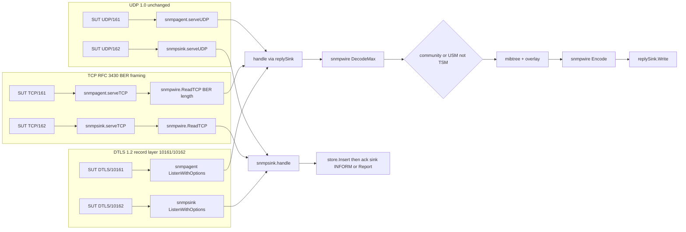
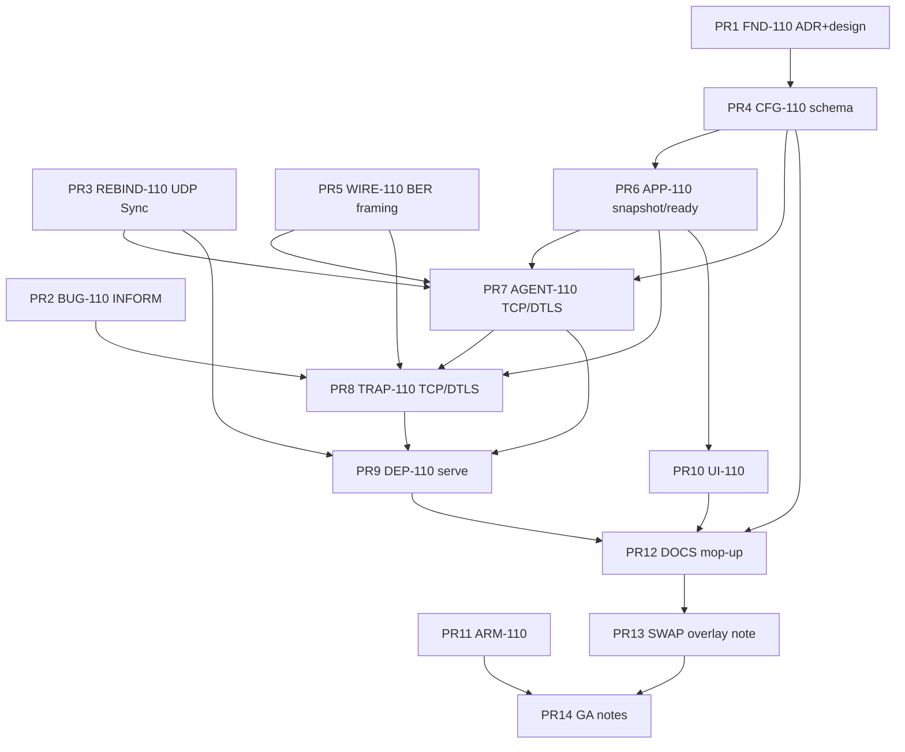

# LabSNMP v1.1 — Residual increment (implementation-ready)

| Field | Value |
|---|---|
| **Title** | LabSNMP residual handling after v1.0.0 |
| **Author** | Grok (design-doc-writer) |
| **Date** | 2026-09-05 |
| **Status** | Draft |
| **Product** | LabSNMP |
| **Target version** | **v1.1.0** (TLS-001 ships; not a 1.0 retcon; not a patch-only tag) |
| **Baseline** | tag `v1.0.0` @ `7ccbc6908fa5b1e81c9490be8882c2ba6dc6b605`, image `ghcr.io/hilather/labsnmp:v1.0.0` |
| **Workspace** | `/home/brewerm/git/go-lab-snmp` (living product at repo root) |
| **Design pack** | `go-lab-snmp-design-pack/` — frozen; do not edit |
| **Authority order** | ADRs > `AGENTS.md` > numbered `docs/00`–`13` > `docs/implementation-design.md` > wave tasks |
| **1.0 design (shipped, do not reopen)** | `/home/brewerm/git/go-lab-snmp/IMPLEMENTATION-DESIGN.md` |
| **This increment's durable copy** | `IMPLEMENTATION-DESIGN-v1.1.md` (new file; see K1.1) |
| **DESIGN_ID** | `cb707fde` |

This document is the implementation-ready spec for the **v1.1 residual increment**. It does not reopen 1.0 architecture, capability IDs, USM algorithms, or the two-plane process. Changing an invariant requires an ADR first (this increment adds **ADR 0016** for TCP/DTLS transport).

---

## Overview

LabSNMP 1.0.0 shipped a laboratory SNMPv1/v2c/v3 UDP agent (161) and a receive-only trap/inform sink (162), with REST `/v1`, MCP `snmp_*` / `labsnmp://`, and an operator SPA. Several residuals were locked in `docs/known-limitations.md` and `docs/releases/v1.0.0.md`. The named deferred product item is **TLS-001**: `spec.listeners.dtls.enabled: true` and `spec.listeners.tcp.enabled: true` still reject with `tls_unsupported` (`internal/config/validate.go` `validateListeners`, locked by `TestTLS001StillDeferred`).

This increment **implements TLS-001 at lab fidelity**: RFC 3430 SNMP-over-TCP (stdlib; **BER-length framing**, not a 32-bit prefix) plus a **DTLS 1.2 record layer** on IANA 10161/10162 wrapping the existing community/USM PDU path. It does **not** implement RFC 6353 TLSTM/TSM. It **fixes two 1.0 operational defects** (INFORM `InformAck` vs `WriteTo` race; Reset does not rebind UDP sockets), and **adds linux/arm64** to the GHCR publish matrix. Frozen identity, ADRs 0002/0005/0007/0008/0010/0012/0013/0014, and the lab-appliance non-goals stay.

Handle ≠ implement everything. SMIv2 compiler, AgentX, trap forward/originate, OAuth PRM, durable store, extra USM algorithms, RFC 6353 **TLSTM/TSM**, and RFC 6353 **TLS-over-TCP** remain residuals with explicit rationale.

---

## Background & Motivation

### Shipped 1.0 surface

Evidence, not aspiration:

- Schema keys already exist: `internal/model/spec.go` `ListenersSpec.{DTLS,TCP ToggleSpec}`; JSON Schema `$defs/toggle`; examples and `testdata/config/valid/full.yaml` set `enabled: false`.
- Validate rejects `enabled: true` at `spec.listeners.dtls.enabled` / `spec.listeners.tcp.enabled` with `domainerr.CodeTLSUnsupported` (`internal/config/validate.go` lines 128–140). Message text still says “must be false in 1.0”.
- Agent is UDP-only: `internal/snmpagent/server.go` `ListenPacket("udp")` + `handle` replies with `PacketConn.WriteTo`.
- Sink is UDP-only: `internal/snmpsink/server.go` same pattern; INFORM ack is `ack()` → `WriteTo` (`internal/snmpsink/handle.go`).
- Ready (`internal/observability/health.go`) evaluates agent UDP, trap UDP, snapshot, management. No TCP/DTLS facts.
- Image `Dockerfile` `EXPOSE 161/udp 162/udp 8088/tcp`; release.yml `platforms: linux/amd64`.
- Features catalog is the frozen twelve K20 ids (`internal/capabilities/features.go`). Comment: “Do not mint dtls/tcp feature ids.”
- `GET /v1/status` listeners are `agent`, `traps`, `management` (`internal/app/export.go`).

### Pain

1. Testers and SUTs that speak `snmpget tcp:host:161` (RFC 3430) or DTLS-wrapped SNMP cannot use LabSNMP. Schema pretends the keys exist.
2. `TestInformWriteToSource` has a real race: `InformAck.Add` runs **after** `WriteTo`, so `snmptest.MustExchange` can return before the counter increments (`internal/snmpsink/handle.go` `ackInform`). Isolated reruns pass.
3. Reset is documented as bind-new-first (`IMPLEMENTATION-DESIGN.md` Listen; `internal/app/reset.go` calls `snmpRebind` / `trapRebind`), but `cmd/labsnmp/serve.go` never calls `SetSNMPRebind` / `SetTrapRebind`, and neither `snmpagent.Server` nor `snmpsink.Server` implements `Rebind`. Management HTTP does rebind. Changing `spec.listeners.agent.address` in bootstrap then Reset leaves the old UDP socket.
4. linux/arm64 is a publish-matrix residual, not an architecture change. `Dockerfile` already has `ARG TARGETARCH`.
5. `docs/13-integration-lab-swap.md` still shows vendor pin `Ref: v1.0.0-rc.1` after GA tagged `v1.0.0`.

### Why not implement every residual

Expanding “not snmpd / not a manager / no AgentX / no SMIv2 compiler / no trap forward / no OAuth / memory store / bounded USM” would contradict ADRs 0005, 0007, 0008, 0012, 0013 and the lab-appliance identity. Those stay residuals. TLS-001 was explicitly deferred to v1.1 in `tasks/wave-17-dtls-v1.1.md` and `tasks/00-program-board.md` Q3.

---

## Goals & Non-Goals

### Goals (v1.1.0)

1. **RFC 3430 SNMP over TCP** on the agent and trap planes when `spec.listeners.tcp.enabled: true`. Stream framing is the **BER length** of a single SNMP message (RFC 3430 §2.1), implemented in first-party `snmpwire`. Same community/USM/maps/SET overlay as UDP. INFORM/Report ack is `Write` of that BER message on the accepted connection — never `Dial`.
2. **DTLS 1.2 record layer** on IANA ports 10161/10162 when `spec.listeners.dtls.enabled: true`, with file-ref server cert/key. Inner SNMP remains v1/v2c community or v3 USM. **TLSTM/TSM is not implemented.** Do not describe this as “RFC 6353 implemented.”
3. **UDP mapping remains implemented** (RFC 3430 §1 product capability). A given process **instance** may disable agent UDP when at least one other **agent-plane** listener (TCP or DTLS) is enabled (lab: host snmpd holds 161/udp). Two planes, one process. Management off still answers.
4. **INFORM race fix** in `internal/snmpsink` with a regression that fails on the 1.0 order.
5. **Reset rebinds data-plane sockets** (UDP + new TCP/DTLS) bind-new-first, flags still win.
6. **linux/arm64** GHCR image alongside amd64. Same Dockerfile, buildx, qemu for the foreign arch. CI unit jobs stay `ubuntu-latest` (amd64).
7. **Docs, checkdocs phrases, AGENTS rule 11, D12, known-limitations, CHANGELOG, `docs/releases/v1.1.0.md`** ship with the behavior PRs.
8. SPA Status/Overview remain in parity with the status listener list (no new capability IDs).

### Non-goals (still residual after v1.1)

- Production agent / snmpd / manager CLI / AgentX / SMUX / net-snmp wrap
- SMIv2 compiler (ADR 0008)
- USM SHA-384/512, AES-192/256 (ADR 0012) — still `usm_alg_unsupported`
- Trap forward or originate (ADR 0007); reserved-key prefixes unchanged
- RFC 6353 **TLSTM / TSM** (`msgSecurityModel = 4`) and certificate→securityName mapping. DTLS in 1.1 is a record layer only.
- RFC 6353 **TLS over TCP** (snmp-tls / snmp-trap-tls). Schema has `tcp` (cleartext RFC 3430) and `dtls` (DTLS record layer) only. Do not add `spec.listeners.tls`
- OAuth PRM / HTTP Basic (ADR 0005)
- Durable spool / multi-replica (ADR 0013)
- Independent VACM group/view DSL
- Prometheus client
- Product logic or vendor.go in mcp-integration-lab (integrator pin remains out of band)
- Minting `dtls` / `tcp` / `ui.enabled` feature catalog ids (K20 frozen)
- Weakening USM because DTLS exists
- Inline secrets, kebab YAML, `spec.management.auth`
- New capability IDs
- Reopening 1.0 PDU semantics

---

## Residual inventory (source of truth)

Every item in living `docs/known-limitations.md` and `docs/releases/v1.0.0.md`, plus unlisted 1.0 delivery gaps. Disposition is one of: **implement** / **keep residual** / **ops/bug**.

| # | Residual | Source | Disposition | Rationale |
|---|---|---|---|---|
| R1 | Not a production agent. Not snmpd. Not a manager. | known-limitations, release notes | **Keep residual** | Product identity. ADR 0002/0007. Docs stay; `scripts/checkdocs` still requires “Not a production agent”. |
| R2 | No SMIv2 compiler. Numeric OIDs + optional aliases. | known-limitations, ADR 0008 | **Keep residual** | Expanding requires a new ADR replacing 0008. YAML maps are the 1.0 contract. No compiler in this increment. |
| R3 | v3 algs MD5/SHA-1/SHA-256 + DES/AES-128 only; SHA-384/512 and AES-192/256 → `usm_alg_unsupported` | known-limitations, ADR 0012, AGENTS §8 | **Keep residual** | Allowlist is frozen. DTLS does not add algs. Locked tests stay. |
| R4 | TLS-001: `dtls.enabled` / `tcp.enabled` true → `tls_unsupported` | known-limitations, wave-17, AGENTS §11, `validate.go` | **Implement** | Named 1.0 deferral. Schema keys exist. See Proposed Design. Requires **ADR 0016**. |
| R5 | No TCP/DTLS SNMP | known-limitations | **Implement (lab fidelity)** | Same as R4. Remaining after v1.1: TSM + TLS-over-TCP (R4a/R4b). |
| R6 | No AgentX | known-limitations, reserved `agentx*` | **Keep residual** | Reserved-key reject stays. Not a subagent host. |
| R7 | No trap forward or originate | known-limitations, ADR 0007 | **Keep residual** | INFORM `WriteTo`/`Write` on the accepted socket only. No Dial. Reserved `forward*` / `trapdest*` / `notifytarget*` / `proxy*` / `manager*` stay. |
| R8 | Trap `remoteAddr` best-effort under Docker userland-proxy; **NAT collision** does not affect split-horizon | known-limitations, docs/02, ADR 0014 | **Keep residual** | Identity is community/user, not client IP (AGENTS §14). Do not copy LabNTP unmatched-drop. `remoteAddr` remains best-effort. checkdocs still requires `NAT collision` + `userland-proxy`. |
| R9 | Single replica. Memory store only. Overlay and trap inbox wipe on reset/restart | known-limitations, ADR 0003/0013 | **Keep residual** | Lab appliance. No spool. |
| R10 | No OAuth PRM | known-limitations, ADR 0005 | **Keep residual** | `auth.mode: bearer` only. |
| R11 | linux/arm64 is not in this tag | known-limitations, release.yml `linux/amd64` | **Implement** | Build/publish matrix only. Dockerfile already `GOARCH=${TARGETARCH:-amd64}`. |
| R12 | Integrator pin in mcp-integration-lab is out of band | known-limitations, SWAP-001 | **Keep residual** | Last, orchestration-only, no product logic in this repo. Update the **example** Ref in docs/13 from `v1.0.0-rc.1` to `v1.0.0` now and `v1.1.0` at GA (docs-only). Do not implement `vendor.go`. |
| U1 | `TestInformWriteToSource` flake: `InformAck.Add` after `WriteTo` | 1.0 delivery note | **Ops/bug — implement** | Confirmed in `ackInform`. Store-then-ack order is already correct (ADR 0007). Counter-vs-WriteTo is not. |
| U2 | Reset does not rebind agent/trap sockets | code vs docs | **Ops/bug — implement** | `app.reset.go` hooks exist; `serve.go` never installs them; servers have no `Rebind`. |
| U3 | docs/13 vendor pin example `v1.0.0-rc.1` | docs/13 | **Ops/docs — implement** | Example Ref must not lag the shipped tag. Still out of band as a pin. |
| U4 | AGENTS §11 / D12 / docs/01 invariant 10 still say `enabled: true` rejects | living docs vs v1.1 | **Docs with R4** | AGENTS §11 + checkdocs phrases in **PR 4 (CFG)** with the validate flip. |

After v1.1, `docs/known-limitations.md` is rewritten as the **1.1 residual surface** (see Documentation). `tls_unsupported` remains in the domainerr catalog for TLS-over-TCP (not emitted on `dtls`/`tcp` enable; TSM-on-the-wire is `auth_fail`).

### R4 remaining after this increment (must not silently drop)

| Residual | After v1.1 |
|---|---|
| RFC 6353 TLSTM/TSM (`msgSecurityModel = 4`), cert fingerprint → securityName, `tmStateReference` | **Keep.** Inner PDUs stay community/USM. TSM datagrams decode as v3 with non-USM model; `usm.Engine.Open` returns `Drop` (`internal/usm/process.go` line 31). Metric `auth_fail` — **not** `tls_unsupported` (that code is catalog-only after 1.1). Document in known-limitations and docs/02 as “DTLS record layer on 10161/10162; TLSTM/TSM not implemented.” |
| RFC 6353 TLS-over-TCP (snmp-tls 10161/tcp) | **Keep.** `tcp.enabled` is RFC 3430 cleartext. No `spec.listeners.tls` key (unknown_field if invented by a user). Catalog code `tls_unsupported` retained for this residual, not emitted on current keys. |
| DTLS 1.3 | **Keep.** pion/dtls v3 DTLS 1.2 only for 1.1 (v3 branch; 1.3 is main, untagged). |
| Client cert as the view identity | **Keep.** Optional `clientCAFile` authenticates the transport; views still key on community/user. |

---

## Frozen identity (unchanged)

Copied from `AGENTS.md`. Do not rename.

| Field | Value |
|---|---|
| Product | LabSNMP |
| Binary | `labsnmp` |
| Module | `github.com/hilather/go-lab-snmp` |
| Image | `ghcr.io/hilather/labsnmp` |
| Schema | `labsnmp.dev/v1alpha1` (same group; additive listener fields) |
| Kind | LabSNMP |
| Cookie | `labsnmp_session` |
| CSRF | `X-LabSNMP-CSRF` |
| User | `65532:65532` |
| Config | `/etc/labsnmp/config.yaml` |
| Token | `/run/secrets/labsnmp-token` |
| labinfo id | `labsnmp` |
| MCP tools | `snmp_*` (frozen table in docs/05) |
| Resources | `labsnmp://…` |
| MCP protocol | `2026-07-28` |
| Go | **1.26 language** (any 1.26.x; no `toolchain go1.26.6`; no `GOTOOLCHAIN=local`) |
| MCP SDK | `github.com/modelcontextprotocol/go-sdk v1.7.0` |
| License | Apache-2.0 |

---

## Key Decisions

### K1.1 — Durable design lives in `IMPLEMENTATION-DESIGN-v1.1.md`

**Decision:** Add `/home/brewerm/git/go-lab-snmp/IMPLEMENTATION-DESIGN-v1.1.md` as the durable in-repo copy of this increment. Do **not** rewrite `IMPLEMENTATION-DESIGN.md` (that file is the shipped 1.0 PR plan and K-decisions). PR 1 lands the design file, ADR 0016, ADR index, and `tasks/` board **only**. Living `AGENTS.md` §11 and `scripts/checkdocs` limitation phrases change in **PR 4 (CFG)** with the validate flip, not in PR 1.

**Rationale:** Mixing v1.1 into the 1.0 design retcons GA. Rewriting AGENTS §11 (“TCP/DTLS legal”) before validate actually allows `enabled: true` makes checkdocs and the binary disagree.

### K1.2 — Target version is v1.1.0

**Decision:** Tag `v1.1.0`. Not `v1.0.1` (TCP/DTLS are features). Not `v2.0.0` (no breaking YAML: `enabled: false` remains default; 1.0 documents still validate).

### K1.3 — ADR 0016 before flipping `tls_unsupported`

**Decision:** `docs/adr/0016-tcp-dtls-transport.md` (Accepted) records, in this order:

- TCP = RFC 3430, **BER-length framing** (§2.1), port 161/tcp / 162/tcp.
- DTLS = **DTLS 1.2 record layer on IANA 10161/10162**; inner PDU is community or USM; **TLSTM/TSM not implemented.** Do not write “RFC 6353 implemented.”
- TLS-over-TCP remains residual (no `spec.listeners.tls`).
- `enabled: true` is legal in 1.1 when K1.4 constraints hold.
- LabSNMP **implements** the UDP mapping (RFC 3430 §1). A process instance may disable UDP agent when TCP or DTLS agent is on (K1.15).
- Cipher policy for DTLS: K1.21.

AGENTS §11 and docs/01 invariant 10 are updated in **PR 4 (CFG)** with the validate flip.

**Rationale:** AGENTS: “Changing an invariant requires an ADR first.” 1.0 invariant 10 is the reject.

### K1.4 — TCP enablement is per listener, not “UDP plane ⇒ TCP”

**Decision:** `spec.listeners.tcp` grows from `ToggleSpec` to `enabled` plus optional `address` / `trapsAddress`. Resolution:

1. Agent TCP is on iff `tcp.enabled` and not both of (UDP agent off **and** `tcp.address` empty).
2. If `tcp.address` is non-empty, bind that TCP address regardless of UDP agent on/off. This is the lab case: host snmpd holds UDP 161, LabSNMP answers `snmpget tcp:`.
3. If `tcp.address` is empty, inherit the **effective** agent UDP host:port **only if UDP agent is also on**. CLI `--snmp-listen` still wins for that UDP address, so `--snmp-listen=:1161` + `tcp.enabled` + empty `tcp.address` binds UDP 1161 **and** TCP 1161.
4. If UDP agent is off and `tcp.address` is empty, agent TCP is off.
5. Same four rules for traps (`tcp.trapsAddress` / `--trap-listen` / `traps.enabled`).
6. `tcp.enabled: true` with **both** resulting TCP addresses off → `validation_failed` on `spec.listeners.tcp.enabled` (“tcp.enabled requires an agent or trap TCP address”).
7. No `--tcp-listen` flag.

`spec.listeners.dtls` cannot share a UDP socket with SNMP UDP (K1.16). Fields: `enabled`, `address` (default `:10161` when enabled), `trapsAddress` (default `:10162` when enabled), `certFile`, `keyFile`, optional `clientCAFile`. CLI: `--dtls-listen` / `--dtls-trap-listen` (`ADDR|off`). DTLS agent does **not** require UDP agent (K1.15).

**Rationale:** Coupling TCP to “agent plane on” blocked TCP-only next to snmpd and contradicted DTLS. Inheritance remains the zero-config RFC 3430 161/tcp path when UDP is on.

### K1.5 — RFC 3430 framing is BER length, in `snmpwire`; no new package

**Decision:** Add `snmpwire.ReadTCP` / `snmpwire.WriteTCP`. Framing is RFC 3430 §2.1, verified against https://www.rfc-editor.org/rfc/rfc3430.txt:

- Each message is **one BER-encoded SNMP message**. There is **no** 32-bit length prefix. A 4-byte prefix is a different, non-RFC framing and MUST NOT be named RFC 3430.
- `ReadTCP` reads the BER identifier and length from `io.Reader` using existing `internal/snmpwire` BER helpers (`reader.length` in `ber.go`, tag `0x30` for SEQUENCE), then `io.ReadFull` exactly that many content octets, and returns identifier+length+content. `DecodeMax` parses the assembled slice. Total size > `maxMessageBytes` → `ErrTooLarge` and close.
- On loss of framing (truncated, indefinite length, ASN.1 parse error) the server **closes the TCP connection** (RFC 3430 §2.1 SHOULD).
- `WriteTCP` writes the BER message bytes only (`Encode`/`EncodeMax` output). No prefix.
- Golden of a framed Get **starts with `0x30`**, not `00 00 00 xx`. Locked interop: skip-if-missing `snmpget … tcp:127.0.0.1:PORT`.
- Do **not** create `internal/snmptrans` or `internal/snmpdtls`. TCP/DTLS accept loops live in `internal/snmpagent` and `internal/snmpsink`. PDU dispatch uses unexported `replySink`.

Also RFC 3430 §2.1–§2.3 lab choices (K1.20): no pipelining; `SetNoDelay(true)`; ≥8192 already implied by default `maxMessageBytes` 64KiB.

**Rationale:** net-snmp `asn_check_packet` and Wireshark SNMP-over-TCP follow BER. A 32-bit prefix would fail the interop test this design itself requires.

### K1.6 — DTLS uses pion/dtls v3 `ListenWithOptions`; stdlib has no DTLS

**Decision:** Go 1.26 `crypto/tls` has **no DTLS**. **New direct dep:** `github.com/pion/dtls/v3` pinned in **PR 7 (AGENT-110)** `go.mod` to **v3.1.8** or a newer **patch** that `govulncheck` accepts (v3.1.3 retracted, GO-2026-6165). Not `@latest`. pion is **pure Go**; `CGO_ENABLED=0` scratch builds stay valid.

Production API (v3.1.8): **`dtls.ListenWithOptions(network, *net.UDPAddr, ...ServerOption)`**. Parse YAML/CLI with `net.ResolveUDPAddr`. Options: `WithCertificates`, `WithExtendedMasterSecret(dtls.RequireExtendedMasterSecret)`, and if `clientCAFile` set `WithClientCAs` + `WithClientAuth(dtls.RequireAndVerifyClientCert)` (pion’s `ClientAuthType`, **not** `crypto/tls.ClientAuthType`). `WithOnConnectionAttempt` is `func(net.Addr) error` (non-nil aborts; do not use a `bool` callback). **Never** set `InsecureSkipVerifyHello`. **Never** call deprecated `dtls.Listen` / `*dtls.Config`. **Never** call `dtls.Dial` outside `_test.go` (production Dial AST would fail; good).

Handshake: `HandshakeContext` with timeout `dtlsHandshakeTimeout` (10s, named constant, not YAML). If it returns an error, `Close` the conn and **do not** enter `handle`. Idle: `dtlsIdleTimeout` (30s), same for TCP (`tcpIdleTimeout`). Cookie/HelloVerify stays on.

Cert/key/`clientCAFile` paths resolve with the same CWD-then-`baseDir` candidate list as `readSecretFile` (`internal/config/secret.go`), then `tls.LoadX509KeyPair` on the resolved paths. Do **not** use `trimmedSecret` (token floor / whole-file trim is wrong for PEM).

Import pion **only** from `internal/snmpagent` and `internal/snmpsink` (and `_test.go` / `internal/snmptest`). `snmpwire` stays dep-free. **PR 7** writes MIT copyright into `NOTICE` (MIT requires the notice) and lists transitives in the PR body: `github.com/pion/logging`, `github.com/pion/transport/v3` (or v4 as the pin pulls), `golang.org/x/crypto`. `make security-scan` is a **merge gate of PR 7 (AGENT-110)**, not only GA. Do not add pion in PR 6 (APP-110).

**Rationale:** Default “no new deps” is exhausted. Functional options are the non-deprecated v3 API.

### K1.7 — Inner SNMP stays community/USM; TLSTM/TSM is residual

**Decision:** After TCP or DTLS termination, `snmpwire.DecodeMax` + existing `handleCommunity` / `handleV3`. `msgSecurityModel != 3` still `Drop` (`usm.Engine.Open`). Do not invent `transportUsers`, fingerprints, or TSM YAML. Do not mint USM algorithms. DTLS confidentiality does **not** make v1/v2c communities confidential on UDP.

Naming in ADR 0016, docs/02, known-limitations, and labinfo: **“DTLS record layer on IANA 10161/10162; inner PDU is community or USM; TLSTM/TSM not implemented.”** Interop does **not** run net-snmp `-T dtlsudp` (that is TSM). TSM-on-the-wire is `auth_fail` / Drop, **not** `tls_unsupported`.

**Rationale:** RFC 6353 is TLSTM. Implementing TSM would be a second identity plane. Lab 1.1 is “same maps over more transports.”

### K1.8 — `tls_unsupported` no longer fires on dtls/tcp enable

**Decision:** After ADR 0016 + PR 4:

- `tcp.enabled: true` → K1.4 address rules; success.
- `dtls.enabled: true` → `certFile`/`keyFile` required; resolve via `readSecretFile` candidates then `tls.LoadX509KeyPair` at **validate** (bad PEM fails closed). Success.
- Missing certs → `validation_failed` / `required`, not `tls_unsupported`.
- `tls_unsupported` stays in `internal/domainerr` and docs/05 as a **catalog fossil** for TLS-over-TCP / a future `spec.listeners.tls`. It is **not** emitted by current keys and is **not** the TSM-on-the-wire error. Locked test: catalog still contains it.
- Fixtures: `invalid/{dtls,tcp}-enabled.yaml` replaced (tcp becomes valid; dtls without cert stays invalid under a new name).

There is **no** validate fork that re-emits `tls_unsupported` for `dtls.enabled` if pion is blocked. If PR 7 cannot pin a clean pion, DTLS listen code does not merge; schema may still accept `dtls.enabled` (PR 4–9 window: “schema legal, not listening” until DEP, and if DTLS never merges, serve fails closed when `dtls.enabled` because the listener cannot bind — K1.19). Do not resurrect 1.0 reject-only-dtls in validate.

**Rationale:** Reusing `tls_unsupported` for “you turned it on” after we support it would lie. A split validate path would bit-rot.

### K1.9 — No `dtls`/`tcp` feature ids; status listeners grow

**Decision:** K20 table stays twelve rows. `GET /v1/features` unchanged. `GET /v1/status` / `snmp_status_get` `listeners[]` may include `agent-tcp`, `traps-tcp`, `agent-dtls`, `traps-dtls` when enabled (address `off` when disabled, matching `agent`/`traps` today). SPA Status/Overview already iterate `status.listeners`; add explicit dt/dd for TCP/DTLS when present (docs/12 Mira: no new capability IDs).

Listener enable remains **reset-only**. No apply op.

### K1.10 — Ready includes every enabled listener; UDP is not mandatory when off

**Decision:** Extend `observability.Facts` with `TCPBound`/`TCPOff`, `TrapTCPBound`/`TrapTCPOff`, `DTLSBound`/`DTLSOff`, `TrapDTLSBound`/`TrapDTLSOff`. Off when YAML/CLI disabled (same shape as `TrapOff`). Ready = snapshot AND every **enabled** data-plane listener bound AND (mgmt bound or off).

`App.HealthFacts` (PR 6, no cmd import) **overlays Off from the active snapshot** (and CLI overrides once they live on `app.Options`) **before** returning to `Evaluate`:

- `AgentOff = true` when UDP agent is disabled (`!snap.AgentEnabled` or `--snmp-listen=off`)
- `TrapOff = true` when trap UDP is disabled
- `TCPOff = true` when `!snap.TCPEnabled` (or agent-TCP resolves off per K1.4)
- same for `TrapTCPOff` / `DTLSOff` / `TrapDTLSOff`

Serve’s `SetHealth` callback may still set `*Bound` (and may repeat Off). The snapshot overlay is the fail-safe: after APP-110, default YAML (`tcp.enabled: false`) stays Ready even though serve has not learned the new Facts fields yet. Zero-value `TCPOff` must **not** demand a TCP bind. Update `Evaluate` tests to pass the new Off flags; do **not** require cmd changes in APP-110. K1.19 (start bind failure is exit 1) is unchanged.

### K1.11 — pion is inbound Accept, not Dial

**Decision:** Production Dial AST still forbids `Dial` / `DialTimeout` / `DialContext` / `net.Dialer` in the listed production packages. TCP is `net.Listen` + `Accept`. DTLS is `ListenWithOptions` + `Accept`. INFORM/Response/Report is `Write` on the accepted conn. Tests (`internal/snmptest`) may `Dial` / `dtls.Dial`.

### K1.12 — arm64 is publish-only; CI stays amd64

**Decision:** `.github/workflows/release.yml` `platforms: linux/amd64,linux/arm64` with `docker/setup-qemu-action` **pinned by commit SHA** (same style as `actions/checkout@3d3c42e5…`) plus existing buildx. No qemu unit tests. `latest` still only on non-prerelease tags. Manifest list is the pin.

### K1.13 — Default overlay keeps tcp/dtls false; DTLS host map is 2161, not 10161

**Decision:** `examples/labsnmp.yaml` stays `enabled: false`. Compose smoke stays UDP `:1161`/`:1162`. No `LABSNMP_DTLS_PORT`. Optional TCP publish uses the **same** residual host number as UDP (`10161:161/tcp`). Optional DTLS publish in docs/11 is copy-paste that cannot be confused with ADR 0014:

```yaml
# docs/11 only; overlay does not enable dtls
ports:
  - "2161:10161/udp"   # host 2161 → container DTLS agent :10161
  - "2162:10162/udp"   # host 2162 → container DTLS trap  :10162
```

ADR 0014 unchanged.

### K1.14 — INFORM and Report share one `ack(sink)`; count before Write

**Decision:** `storeAndAck` already stores first (ADR 0007). Change `ackInform` to `InformAck.Add(1)` **before** `ack(sink, out)`. v3 engine-discovery **Report** (`handle.go` `ack(pc, addr, report)`) uses the **same** `ack(sink, out)` so TCP writes BER (`WriteTCP`) and DTLS writes the datagram — never Dial, never a second ack path. Regression: UDP `PacketConn` wrapper whose `WriteTo` fails if `InformAck.Load() < 1`. Keep `TestInformWriteToSource`. Encode failure does not increment. Write errors ignored (same as `_, _ = pc.WriteTo`).

### K1.15 — Serve may start with agent UDP off if TCP or DTLS agent is on

**Decision:** RFC 3430 §1 “MUST also implement UDP” is a **product** requirement: LabSNMP always contains the UDP mapping. A **process instance** may disable it.

`cmd/labsnmp/serve.go` today exits 1 if `--snmp-listen=off` or `listeners.agent.enabled: false`. Change:

- Exit 1 only when **no agent-plane listener** will bind (UDP agent off **and** agent TCP off **and** agent DTLS off). Trap-only remains illegal (unchanged 1.0: agent plane required).
- When UDP agent is off, `HealthFacts` overlays `AgentOff = true` (K1.10) so Ready does not demand UDP.
- `DesiredListeners.AgentUDP == ""` **stops** the UDP socket (match trap: `newTrap != oldTrap` already unbinds). 1.0 reset skipped empty SNMP; that is the U2 cousin of “cannot unbind agent.”
- DTLS-only and TCP-only are in-scope. The docs/08 “no cleartext” recipe is: UDP agent+traps off, `tcp.enabled: false`, `dtls.enabled: true` with certs — **allowed**. At least one community or user is still required (validate step 5).

### K1.16 — Validate rejects UDP/DTLS bind collision

**Decision:** If agent UDP and agent DTLS are both enabled, the resolved UDP addresses (host:port after defaults/flags at validate time: YAML addresses; CLI flags are serve-time) must be distinct. Same for traps. Fail closed `validation_failed` / `invalid_value` on `spec.listeners.dtls.address` (or `trapsAddress`) with message that DTLS and SNMP UDP cannot share a socket (no demux; A5). Serve-time CLI `--dtls-listen=:161` while `--snmp-listen=:161` also fails bind; SyncDataPlane bind-new-all then rolls back (K1.17). Validate covers the YAML case.

Compare as `net.ResolveUDPAddr` canonical strings (including implied `0.0.0.0` vs `:port` — treat `:161` and `0.0.0.0:161` as equal).

### K1.17 — One rebind API: `SyncDataPlane(desired)` bind-all-new then commit

**Decision:** There is **no** menu of `StartTCP` vs `SetTCPRebind` vs `SyncTransports`. Serve and Reset both drive **one** bind function in `cmd/labsnmp`. App does not import snmpagent/snmpsink.

`DesiredListeners` is defined in **`internal/app`** (tiny DTO; cmd and reset share it). Empty address = off.

```go
// internal/app — filled by resetLocked / serve from the *candidate* snapshot, not Active().
type DesiredListeners struct {
    AgentUDP, TrapUDP   string
    AgentTCP, TrapTCP   string // PR 6+; empty in PR 3
    AgentDTLS, TrapDTLS string // PR 6+
}

func (s *App) SetDataPlaneSync(fn func(desired DesiredListeners) error)
```

**Who computes `desired`:** `resetLocked`, exactly as it computes `newSNMP` today (`internal/app/reset.go` lines 61–73): from **`next`** (the compiled candidate) plus existing `effectiveSNMP` / `effectiveTrap` / new DTLS override helpers on `app.Options`. Then it calls `s.dataPlaneSync(desired)` **before** Swap. Cmd’s `dataPlane.Sync(desired)` **only binds**; it must **not** re-read `svc.Active()` (that is still the old snapshot). Serve at process start builds the same DTO from the first compile + flags and calls `Sync` once.

A zero-arg `SetDataPlaneSync(func() error)` is **forbidden** — a closure over `Active()` would rebind to the old addresses and leave U2 broken.

**Algorithm (transactional), inside `dataPlane.Sync`:**

1. Compare `desired` to currently bound sockets (inherited TCP addr is already resolved in the DTO as the effective UDP host:port when K1.4 inherit applies).
2. For each listener whose desired addr is non-empty **and** differs from current (or is new): **bind the new socket first**. Do not close any old socket yet.
3. If any new bind fails: close every socket opened in step 2; return error; **active snapshot unchanged**; old listeners keep serving (Ready stays true on old sockets — docs/09).
4. Only then: close listeners that are removed or replaced; swap the Server fields to the new sockets. Reset then Swaps the snapshot.

Inherited TCP is not a special case: `resetLocked` sets `desired.AgentTCP` to the effective UDP host:port when inherit applies. Locked test: change `agent.address` with `tcp.enabled` and empty `tcp.address` → both UDP and TCP desired addrs are the new port, both rebind.

**In-flight TCP/DTLS connections:** closed when their listener is shut down. Lab; **no drain**. UDP in-flight goroutines already end on conn close.

**U2 UDP-only slice:** PR 3 REBIND-110 implements `Sync` for UDP agent+trap only (TCP/DTLS fields empty) and wires serve+Reset with the typed hook. That **is** the U2 fix and may merge next to BUG-110, before pion. PR 6 adds TCP/DTLS fields to the DTO and fills them from `next`. AGENT/TRAP extend `Sync` with those binds. DEP does not invent a second hook.

Remove `SetSNMPRebind`/`SetTrapRebind` from the serve path once `SetDataPlaneSync` exists (keep the old setters for existing `reset_test.go` until that test switches, in PR 3).

### K1.18 — Cap accepted TCP and DTLS conns, including in-handshake

**Decision:** Named constant `MaxAcceptedConns = 1024` **per stream listener** (agent TCP, trap TCP, agent DTLS, trap DTLS), independent of UDP `DefaultMaxInflight`. The Accept loop increments the cap **before** handshake (DTLS) / before the first `ReadTCP` (TCP). Excess `Accept` → close immediately, metric `labsnmp_pdus_total`/`labsnmp_traps_total` `decision=admission` (same decision set; no new label). UDP inflight stays 1024 datagrams.

pion: `WithOnConnectionAttempt(func(net.Addr) error)` runs the CIDR allowlist **before** handshake against the **live** snapshot prefixes (same as UDP `syncAdmission`, not a listen-time capture); non-nil error aborts the attempt. Token buckets count **PDUs** on TCP (one ReadTCP = one PDU) and **datagrams** on UDP/DTLS — not SYNs. Do not add a SYN rate-limit in 1.1.

RFC 3430 §2.3: refusing new connections under pressure is the specified control.

### K1.19 — Enabled listener bind failure is process exit 1

**Decision:** At `serve` start, if any **enabled** data-plane listener cannot bind, the process prints the error and **exits 1**, same as agent UDP listen failure today. Do not stay up with Ready false.

PR 4–9 window: YAML with `tcp.enabled`/`dtls.enabled` **validates** but those listeners do not exist until AGENT/TRAP/DEP. Document as “schema legal, not listening.” Testers in that window get UDP-only; that is expected.

### K1.20 — TCP lab profile: no pipelining, TCP_NODELAY, close on framing loss

**Decision:** One goroutine per accepted TCP conn: sequential `ReadTCP`; `handle`; `WriteTCP` reply. **No pipelining** in 1.1 (RFC 3430 allows out-of-order responses; we do not). `SetNoDelay(true)` on accepted conns. Framing loss → close (K1.5). Either side may close anytime (RFC 3430 §2.3); idle timeout `tcpIdleTimeout = 30s` is a lab constant, not YAML. `maxMessageBytes` default 64KiB already satisfies §2.2 ≥8192.

### K1.21 — DTLS cipher allowlist and large-PDU test

**Decision:** Allowlist only AEAD suites: ECDHE + AES-GCM and ChaCha20-Poly1305. **No PSK, no CBC** (`TLS_ECDHE_*_CBC_*`, PSK-CCM). Pass the allowlist with `dtls.WithCipherSuites`. If that option is absent on the pinned tag, AGENT-110 fails closed (compile error in `internal/snmpagent/dtls.go`) — do not skip the allowlist. Record in ADR 0016. AGENT-110 includes a DTLS GET of an octet-string **≥8KiB** (testdata map leaf); prefer near `maxMessageBytes` if the test stays CI-safe. pion MTU/handshake fragmentation is the library’s problem; the test locks `Conn.Write` of a large Response succeeds.

### K1.22 — Mira re-review only if UI behavior changes; integrator TCP ports stay off

**Decision:** Mira checklist in docs/12 if Status/Overview copy changes; no new feature ids. Integrator compose does **not** publish `10161/tcp` by default (overlay `tcp.enabled: false`). DTLS 1.3 remains residual (pion v3 is 1.2).

---

## Proposed Design

### Process model (v1.1)



UDP, TCP, and DTLS share one compiled snapshot, one SET overlay, one trap ring. Management remains a second plane.

### Schema (`labsnmp.dev/v1alpha1`)

Replace `ToggleSpec` with the two structs below and **delete `ToggleSpec`** (only dtls/tcp used it).

```go
// internal/model/spec.go

// TCPListenerSpec is RFC 3430 SNMP over TCP. Empty addresses inherit
// the effective UDP agent/trap address only when that UDP listener is on (K1.4).
type TCPListenerSpec struct {
    Enabled      bool   `json:"enabled"`
    Address      string `json:"address,omitempty"`      // agent TCP; empty → inherit if UDP on
    TrapsAddress string `json:"trapsAddress,omitempty"` // trap TCP; empty → inherit if UDP on
}

// DTLSListenerSpec is a DTLS 1.2 record layer (not TLSTM/TSM, not TLS-over-TCP).
type DTLSListenerSpec struct {
    Enabled      bool   `json:"enabled"`
    Address      string `json:"address,omitempty"`      // default :10161 when enabled
    TrapsAddress string `json:"trapsAddress,omitempty"` // default :10162 when enabled
    CertFile     string `json:"certFile,omitempty"`     // required if enabled
    KeyFile      string `json:"keyFile,omitempty"`      // required if enabled
    ClientCAFile string `json:"clientCAFile,omitempty"` // optional; if set, require client cert
}

type ListenersSpec struct {
    Agent      UDPListenerSpec  `json:"agent"`
    Traps      UDPListenerSpec  `json:"traps"`
    DTLS       DTLSListenerSpec `json:"dtls"`
    TCP        TCPListenerSpec  `json:"tcp"`
    Management MgmtListenerSpec `json:"management"`
}
```

KnownFields(true) continues to reject unknown nested keys. `trapsAddress` normalizes to `trapsaddress`, which does **not** match reserved prefix `trapdest`. `certFile`/`keyFile`/`clientCAFile` are file refs; never inline PEM.

JSON Schema `api/jsonschema/labsnmp.dev.v1alpha1.json`: replace `$defs/toggle` with `$defs/tcpListener` and `$defs/dtlsListener` (`additionalProperties: false`). This file is **hand-maintained** (`scripts/generate` does not emit it).

Normalize (`internal/config/normalize.go` `materializeDefaults`):

| Field | Default when empty |
|---|---|
| `listeners.tcp.enabled` | false |
| `listeners.tcp.address` | empty (inherit) |
| `listeners.tcp.trapsAddress` | empty (inherit) |
| `listeners.dtls.enabled` | false |
| `listeners.dtls.address` | `:10161` if enabled, else leave empty |
| `listeners.dtls.trapsAddress` | `:10162` if enabled, else leave empty |

Validate (`validateListeners`) — no “or”s:

1. **Remove** the 1.0 `if l.DTLS.Enabled { tls_unsupported }` / TCP equivalent.
2. If `tcp.enabled`: `validateTCPAddr` on each non-empty `address` / `trapsAddress`. Apply K1.4: empty + UDP off ⇒ that TCP plane off. If **both** TCP planes off → `validation_failed` on `spec.listeners.tcp.enabled`.
3. If `dtls.enabled`: `certFile` and `keyFile` required (not `trimmedSecret` ≥32). Resolve paths with `readSecretFile`’s CWD-then-`baseDir` candidates (`ValidateWithBaseDir`), then `tls.LoadX509KeyPair` on the resolved paths **at validate**. `clientCAFile` if set must parse as an x509 cert pool after the same resolution. `validateUDPAddr` on `address` / `trapsAddress`. If both DTLS planes resolve off → `validation_failed` on `spec.listeners.dtls.enabled`.
4. K1.16: if agent UDP and agent DTLS both enabled, resolved UDP addrs must differ (`invalid_value` on `spec.listeners.dtls.address`). Same for traps / `trapsAddress`.
5. At least one **agent-plane** listener must remain possible (UDP agent or K1.4 agent TCP or agent DTLS). Fail `spec` `required` otherwise (K1.15).
6. Require at least one community or user when **any agent-plane listener will bind**, not when `listeners.agent.enabled` (UDP toggle). Keep the existing message; change only the condition in `internal/config/validate.go` (~53–58). TCP-only / DTLS-only with empty identities is `validation_failed` on `spec`. CFG fixtures: `valid/tcp-only.yaml` (agent.enabled false, tcp.address set, one community); `invalid/tcp-only-no-identity.yaml` (`validation_failed`).

Apply vs reset: `dtls`/`tcp` flags remain **reset-only** (docs/04 table already lists “dtls/tcp flags”). No new apply ops. No new capability IDs.

### RFC 3430 TCP framing (`internal/snmpwire`)

RFC 3430 §2.1 (https://www.rfc-editor.org/rfc/rfc3430.txt): *“Each instance of a message is serialized into a single BER-encoded message”*; *“A receiving SNMP engine MUST therefore use the length field in the BER-encoded SNMP message to separate multiple requests sent over a single TCP connection (framing).”* There is **no** 32-bit prefix.

```go
// tcp.go in internal/snmpwire

// ReadTCP reads one SNMP message from a TCP stream by parsing the BER
// identifier and length, then exactly that many content bytes.
// maxBytes caps identifier+length+content (spec.agent.maxMessageBytes).
// Framing loss returns ErrBER / ErrTruncated / ErrTooLarge; the caller closes.
func ReadTCP(r io.Reader, maxBytes int64) ([]byte, error)

// WriteTCP writes a complete BER SNMP message with no extra prefix.
func WriteTCP(w io.Writer, msg []byte) error
```

Implementation notes:

- Reuse `internal/snmpwire` BER length decode (`reader.length` / definite form only; indefinite `0x80` is `ErrBER`).
- First octet is the tag (golden Get starts with `0x30`). Then length octets. Then content. Return the concatenation so `DecodeMax` sees a complete message.
- Do not interpret PDU types inside `ReadTCP`.
- Fuzz `FuzzReadTCP`: truncated tag, truncated length, indefinite length, length > max, valid Get starting `0x30`.
- Skip-if-missing `snmpget -On -v2c -c public -t 1 -r 0 tcp:127.0.0.1:PORT …` is the interop contract.

Connection reuse (K1.20): one goroutine per conn, sequential Read/handle/Write, `SetNoDelay(true)`, idle `tcpIdleTimeout`, close on framing loss. **No pipelining.**

Trap TCP: TRAPv1 / SNMPv2-TRAP: store, no reply (conn may stay open until idle). INFORM: store then `WriteTCP` Response on **that** conn. v3 Report: same `ack(sink)`. Never `Dial`.

### DTLS termination

pion/dtls v3.1.8 (K1.6, K1.21):

```go
addr, err := net.ResolveUDPAddr("udp", desired) // YAML/CLI
certPath, keyPath := resolveFileRef(certFile, baseDir), resolveFileRef(keyFile, baseDir) // same candidates as readSecretFile
cert, err := tls.LoadX509KeyPair(certPath, keyPath) // already validated
opts := []dtls.ServerOption{
    dtls.WithCertificates(cert),
    dtls.WithExtendedMasterSecret(dtls.RequireExtendedMasterSecret),
    dtls.WithCipherSuites(dtlsAllowlist...), // ECDHE-AES-GCM + ChaCha20-Poly1305 only
    dtls.WithOnConnectionAttempt(func(a net.Addr) error {
        if !cidrOKLive(a) { // live snapshot prefixes, same as UDP syncAdmission
            return errAllowlist
        }
        return nil
    }),
}
// if clientCAFile set: WithClientCAs + WithClientAuth(dtls.RequireAndVerifyClientCert)
// never InsecureSkipVerifyHello; never crypto/tls.RequireAndVerifyClientCert
ln, err := dtls.ListenWithOptions("udp", addr, opts...)
conn, err := ln.Accept()
ctx, cancel := context.WithTimeout(context.Background(), dtlsHandshakeTimeout)
defer cancel()
dtlsConn := conn.(*dtls.Conn)
if err := dtlsConn.HandshakeContext(ctx); err != nil {
    _ = dtlsConn.Close()
    return // do not handle
}
```

Each `conn.Read` is one SNMP message (DTLS application data; **no** RFC 3430 BER-over-stream prefix — DTLS already frames). `conn.Write` sends the response. Cap accepted conns with `MaxAcceptedConns` **including in-handshake** (K1.18).

Do **not** import pion from `snmpwire`, `usm`, `mibtree`, `store`, `app`, `control`, `web`.

SNI: ignored (single cert). No ALPN.

### Agent/sink refactor (`replySink`)

Today `handle` takes `net.PacketConn` and `WriteTo`s. Introduce:

```go
type replySink interface {
    Write(p []byte) error
    RemoteAddr() net.Addr
}

type udpReply struct {
    pc   net.PacketConn
    addr net.Addr
}
func (u udpReply) Write(p []byte) error {
    _, err := u.pc.WriteTo(p, u.addr)
    return err
}

type streamReply struct {
    conn net.Conn
    tcp  bool // true → snmpwire.WriteTCP; false → conn.Write (DTLS)
}
```

`handle` / `handleCommunity` / `handleV3` / `ackInform` / v3 **Report** take `replySink` instead of `PacketConn`. One `ack(sink, out)` for INFORM and Report (K1.14). UDP path wraps `udpReply`. TCP `Write` calls `snmpwire.WriteTCP`. DTLS `Write` calls `conn.Write`.

Admission: CIDR + rate still use `peerAddr(RemoteAddr())` (`netip.Addr.Unmap()`). Identity for **maps** remains community/user. Token buckets: PDUs on TCP, datagrams on UDP/DTLS (K1.18). pion `WithOnConnectionAttempt` applies CIDR **before** DTLS handshake.

UDP `DefaultMaxInflight` (1024) is **datagram** concurrency and must not be shared with TCP/DTLS. Stream listeners use `MaxAcceptedConns = 1024` including in-handshake (K1.18). Excess Accept → close, `decision=admission`.

### Listen addresses and CLI

Effective bind table (serve + Reset). Enablement is **per listener** (K1.4, K1.15):

| Listener | Enable | Address |
|---|---|---|
| agent UDP | `agent.enabled` and not `--snmp-listen=off` | `--snmp-listen` or YAML `agent.address` (`:161`). Off is legal if agent TCP or agent DTLS is on. |
| traps UDP | `traps.enabled` and not `--trap-listen=off` | `--trap-listen` or YAML `traps.address` (`:162`) |
| agent TCP | `tcp.enabled` and (`tcp.address` non-empty **or** UDP agent on) | `tcp.address` if set; else effective agent UDP host:port on `tcp` |
| traps TCP | `tcp.enabled` and (`tcp.trapsAddress` non-empty **or** UDP trap on) | `tcp.trapsAddress` if set; else effective trap UDP host:port |
| agent DTLS | `dtls.enabled` and not `--dtls-listen=off` | `--dtls-listen` or YAML `dtls.address` (`:10161`). Independent of UDP agent. |
| traps DTLS | `dtls.enabled` and not `--dtls-trap-listen=off` | `--dtls-trap-listen` or YAML `dtls.trapsAddress` (`:10162`) |
| management | `--management-listen` address | unchanged |

Serve exits 1 if **no** agent-plane listener (UDP/TCP/DTLS) will bind, or if any **enabled** listener fails to bind (K1.19).

`--management-listen` still defaults **off**. Image CMD still `:8088`.

`labsnmp serve` new flags only:

```
--dtls-listen ADDR|off
--dtls-trap-listen ADDR|off
```

Empty = YAML. `off`/`none`/`-` disables that DTLS plane even if YAML enabled.

Parse alongside existing flags in `cmd/labsnmp/serve.go` `parseServeFlags`. `app.Options` gains `DTLSListenOverride`, `DTLSTrapListenOverride`. Reset uses the same effective-* helpers inside `SyncDataPlane` (K1.17).

### Reset rebind (U2) — `SyncDataPlane` only

See K1.17. No `StartTCP`/`SetTCPRebind` menu. `resetLocked` fills `app.DesiredListeners` from **`next`** and calls `SetDataPlaneSync(func(desired DesiredListeners) error)` **before** Swap. Cmd’s `dataPlane.Sync` only binds.

PR REBIND-110 (next to BUG-110) implements UDP-only Sync and wires serve so Reset actually moves/unbinds UDP. AGENT/TRAP add TCP/DTLS binds to the same `Sync`. Failed new bind rolls back the new sockets; old listeners keep serving; snapshot unchanged. In-flight TCP/DTLS conns are closed when their listener is shut down (no drain).

Locked test: `tcp.enabled`, empty `tcp.address`, change `agent.address` → desired UDP and TCP addrs both change.

### INFORM race (U1)

Current (`internal/snmpsink/handle.go`):

```go
ack(pc, addr, out)
s.InformAck.Add(1)
```

`snmptest.Exchange` uses `net.Dial("udp")` + Read; it can complete after `WriteTo` and before `Add`. **Confirmed race.** Store-vs-ack is already `storePDU` then `ackInform` (ADR 0007: “INFORM is stored first, then acknowledged”).

Fix:

```go
s.InformAck.Add(1)
ack(sink, out) // Write / WriteTo
```

If encode fails, do not increment (unchanged). `WriteTo` errors are ignored today (`_, _ = pc.WriteTo`); counting “we attempted an INFORM ack” is the test-visible contract.

Regression `TestInformAckCountedBeforeWriteTo` in `internal/snmpsink`:

```go
type orderPC struct {
    net.PacketConn
    acks *atomic.Int64
    t    *testing.T
}
func (o *orderPC) WriteTo(p []byte, addr net.Addr) (int, error) {
    if o.acks.Load() < 1 {
        o.t.Error("InformAck must increment before WriteTo")
    }
    return o.PacketConn.WriteTo(p, addr)
}
```

Inject by swapping the server’s PacketConn after `Start` via a test helper in `helper_test.go`. Do not weaken `TestInformWriteToSource`. Report PDUs use the same `ack(sink)` (K1.14); do not grow a second TCP ack path.

### Ports, container, host residual

| Plane | 1.0 | v1.1 addition |
|---|---|---|
| Agent UDP | container `:161`, host residual **10161/udp**, local `:1161` | unchanged |
| Trap UDP | `:162`, **10162/udp**, `:1162` | unchanged |
| Agent TCP | — | container **`:161/tcp`** when enabled and inheriting; or `tcp.address` when UDP is off. Host may publish `10161/tcp` (same residual **number**, different proto). Local `:1161/tcp` via inherit or explicit `tcp.address` |
| Trap TCP | — | `:162/tcp` / `10162/tcp` / `:1162/tcp` or explicit `tcp.trapsAddress` |
| Agent DTLS | — | container **`:10161/udp`** (IANA snmp-dtls). **Not** host residual 10161 (that maps to 161/udp). Off in overlay. Local `--dtls-listen=:2161`. Host map `2161:10161/udp` (K1.13) |
| Trap DTLS | — | container `:10162/udp`. Local `:2162`. Host map `2162:10162/udp` |
| Management | `:8088`, host **18161/tcp** | unchanged |

ADR 0014 **does not change**. Document optional dual-protocol publish:

```yaml
ports:
  - "${LABSNMP_AGENT_PORT:-10161}:161/udp"
  - "${LABSNMP_AGENT_PORT:-10161}:161/tcp"   # only useful if tcp.enabled
# DTLS (docs/11 copy-paste; do not confuse with residual 10161):
# - "2161:10161/udp"
# - "2162:10162/udp"
```

`Dockerfile`:

```
EXPOSE 161/udp 162/udp 161/tcp 162/tcp 8088/tcp
```

Do not EXPOSE 10161/udp (operator confusion with ADR 0014). `NET_BIND_SERVICE` already covers privileged TCP 161/162. DTLS `:10161` does not need the cap. Smoke remains `cap_drop: ALL` on `:1161`/`:1162` UDP; TCP tests in-process bind `:0`.

`examples/compose.smoke.yaml` does **not** enable TCP/DTLS (no certs, keep M3 smoke fast).

### Observability

**Metrics** (docs/09 + `api/metrics/v1alpha1.json` via `make generate`):

| Metric | Kind | Labels | Notes |
|---|---|---|---|
| existing series | — | — | **Unchanged** (no `transport` label) |
| `labsnmp_listeners_bound` | gauge | `component` | `agent`, `traps`, `management`, `agent-tcp`, `traps-tcp`, `agent-dtls`, `traps-dtls`. 1 if bound, 0 if enabled-but-unbound, omitted if off |

Events: keep `snmp.pdu` / `snmp.trap`; set `component` to `snmpagent-tcp` etc. Never label client IP, community, or cert CN.

Health warnings: reuse `WarnListenerUnbound` / `WarnAgentUnbound` / `WarnTrapUnbound` with distinct **messages** (“SNMP agent TCP listener is not bound”). Do not invent `tcp_unbound` / `dtls_unbound`.

### Status DTO

`internal/app/export.go` `Status.Listeners` always includes agent/traps/management (1.0). Append TCP/DTLS rows when the spec has `enabled: true` (address or `off` if bind failed). MCP `statusJSON` already copies the slice. No OpenAPI path change; schema for listener items is `{name, address}` (already).

### SPA

`web/src/pages/StatusPage.tsx` / `OverviewPage.tsx`: keep the generic list. Add optional rows:

```ts
const tcp = status.listeners?.find((l) => l.name === "agent-tcp");
const dtls = status.listeners?.find((l) => l.name === "agent-dtls");
```

Features page: still twelve ids (`FeaturesPage.test.tsx`). No send-trap. Mira: pages present, `assertNoTokenStorage`, CSRF, `ui.enabled: false` 404.

### Interop tests (test-only net-snmp / pion)

Production still must not exec `snmpget`/`snmpwalk`/`snmptrap`. `_test.go` may.

TCP (skip if no net-snmp):

```
snmpget -On -v2c -c public -t 1 -r 0 tcp:127.0.0.1:PORT 10.20.0.3.10.20.0.5.0
```

DTLS: first-party client in `internal/snmptest` using pion `dtls.Client` (test-only is allowed even though production also imports pion). Do **not** require net-snmp `--dtls` TSM; that would test TSM which we do not implement. Document skip.

Dial AST: `internal/snmptest` is **not** in `productionDialPackages`. Keep it that way.

### Security threat model (docs/08 addition)

| Path | Confidentiality | Integrity | View identity |
|---|---|---|---|
| UDP 161/162 v1/v2c | none (community on wire) | none | communityFile bytes |
| UDP v3 USM | AES-128 if authPriv | HMAC | USM user |
| TCP 161/162 | **none** (RFC 3430 cleartext) | none beyond USM | same |
| DTLS + community | DTLS record encryption | DTLS + community still on inner PDU | community, **not** client cert |
| DTLS + USM | DTLS + optional USM priv | both | USM user |

Enabling DTLS does not encrypt leftover UDP listeners. The “no cleartext” recipe (K1.15) is legal: `listeners.agent.enabled: false`, `listeners.traps.enabled: false`, `tcp.enabled: false`, `dtls.enabled: true` with certs. Serve no longer exits 1 solely because UDP agent is off. Default overlay still UDP.

Client cert (`clientCAFile`) is transport auth, not a map key.

Cert/key bytes never in GET state, logs, metrics. Paths may appear.

### linux/arm64

`.github/workflows/release.yml` `publish-image`:

```yaml
- uses: docker/setup-qemu-action@<pin commit SHA like checkout@3d3c42e5> # never @v3 floating tag
# buildx already present
# build-push-action:
  platforms: linux/amd64,linux/arm64
```

CI `container-test` stays amd64 (native). No qemu `go test`. `Dockerfile` `GOARCH=${TARGETARCH:-amd64}` already correct. Scratch image remains CGO_ENABLED=0.

Document in docs/11: “v1.1.0 publishes a multi-arch manifest; digest pin is the manifest list.”

---

## API / Interface Changes

### YAML (additive, fail-closed)

Before (1.0):

```yaml
listeners:
  dtls: { enabled: false }
  tcp:  { enabled: false }
```

After (v1.1, still valid): same document. `enabled: false` ignores extra fields if omitted.

New legal document:

```yaml
listeners:
  tcp:
    enabled: true
    # address omitted → inherit effective agent UDP host:port IFF UDP agent is on (K1.4)
    # trapsAddress omitted → inherit trap UDP IFF UDP trap is on
    # TCP-only: set address explicitly, agent.enabled: false
  dtls:
    enabled: true
    address: ":2161"
    trapsAddress: ":2162"
    certFile: testdata/certs/server.pem
    keyFile: testdata/certs/server-key.pem
    # clientCAFile: testdata/certs/client-ca.pem
```

Unknown keys (`spec.listeners.tls`, `spec.listeners.dtls.tsm`) → `unknown_field`.

### CLI

```
labsnmp serve --config FILE
  [--snmp-listen ADDR|off]
  [--trap-listen ADDR|off]
  [--dtls-listen ADDR|off]
  [--dtls-trap-listen ADDR|off]
  [--management-listen ADDR|off]
  [--shutdown-timeout D]
  [--pid-file FILE]
```

### REST / MCP

No new routes. No new tools. No new resources. Status `listeners` array may grow. Features catalog unchanged (`testdata/mcp/goldens/features.txt` stays twelve lines).

### `snmpwire` API

New exported `ReadTCP` / `WriteTCP` only (BER-length framing, **no** 32-bit prefix). Existing `Decode`/`Encode` unchanged.

### Error catalog

No new codes. `tls_unsupported` retained, not emitted on dtls/tcp enable.

---

## Data Model Changes

Snapshot (`internal/snapshot/snapshot.go`) additive fields compiled from YAML:

```go
TCPEnabled, TCPAddress, TCPTrapsAddress bool/string
DTLSEnabled, DTLSAddress, DTLSTrapsAddress, DTLSCertFile, DTLSKeyFile, DTLSClientCAFile
```

Compiler `Compile` copies them next to `AgentAddress` (`internal/compiler/compile.go` ~146–152). Ready/Status/SyncDataPlane read **snapshot fields only**, never re-parse `Canonical.Spec`.

Migration: none. Memory-only. Old 1.0 YAML loads. Overlay/trap wipe rules unchanged.

Revision hash includes new **paths** (`certFile`) not cert **bytes** (existing secret-path rule).

Testdata:

| Path | Role |
|---|---|
| `testdata/config/valid/tcp-enabled.yaml` | tcp.enabled true, inherit addresses `:0` or high ports |
| `testdata/config/valid/tcp-only.yaml` | `agent.enabled: false`, `tcp.enabled: true`, `tcp.address` set, one community |
| `testdata/config/valid/dtls-enabled.yaml` | dtls.enabled true + cert/key file refs (paths resolved via baseDir) |
| `testdata/config/invalid/dtls-enabled-no-cert.yaml` | enabled true, missing certFile |
| `testdata/config/invalid/dtls-bad-pem.yaml` | unreadable/invalid PEM |
| `testdata/config/invalid/tcp-only-no-identity.yaml` | TCP-only, zero communities and users → `validation_failed` on `spec` |
| Move `invalid/dtls-enabled.yaml` / `tcp-enabled.yaml` | 1.0 reject fixtures; replace with the above |
| `testdata/certs/server.pem` + `server-key.pem` | committed **test** self-signed (lab, not a product secret) |

`TestTLS001StillDeferred` is **deleted** and replaced with `TestTCPEnabledValidates` / `TestDTLSRequiresCert` / `TestTLSUnsupportedStillInCatalog`.

---

## Alternatives Considered

### A1 — Defer DTLS, ship TCP-only as v1.1.0

TCP is zero-new-dep and high value (`snmpget tcp:`). DTLS needs pion.

**Rejected as the sole v1.1 headline.** Wave-17 is “DTLS / TCP SNMP”. Exploration showed DTLS **can** be done without violating Dial/two-plane/file-ref/USM-allowlist.

If PR 7 `govulncheck` fails on the pion pin: **do not merge DTLS listen code** and **do not** reintroduce `tls_unsupported` for `dtls.enabled` in validate (K1.8). TCP (WIRE/AGENT TCP half/DEP) still ships in v1.1.0; DTLS enable then fails closed at bind (K1.19) until a follow-up pin. That is a **PR 7 / ADR 0016** note, not a CFG fork.

### A2 — Implement RFC 6353 TSM as the DTLS identity plane

Certificate fingerprint → securityName → map. Matches net-snmp `-T dtlsudp`.

**Rejected for v1.1.** New YAML identities, new security model, new tests, likely new error codes. Contradicts “do not invent” and would dwarf TCP. Remaining residual, documented.

### A3 — First-party DTLS in stdlib crypto

**Rejected.** Go 1.26 has no DTLS. A first-party record layer is a crypto project, not a lab increment.

### A4 — TLS-over-TCP via `crypto/tls` instead of DTLS

stdlib can do TLS on TCP. Schema key is `dtls`, not `tls`. RFC 6353 TLS-over-TCP is a different port/profile (snmp-tls).

**Rejected as a substitute.** Could be v1.2 with a new schema key and ADR. Do not overload `tcp.enabled` to mean TLS.

### A5 — Demux DTLS and SNMP on UDP 161

DTLS content types 20–24 vs BER SEQUENCE 0x30.

**Rejected.** Fragile, surprises packet traces, collides with RFC 6353 port 10161.

### A6 — New package `internal/snmptrans`

**Rejected.** Invents a path. Framing belongs in `snmpwire`; listen belongs in agent/sink.

---

## Security & Privacy Considerations

| Risk | Severity | Mitigation |
|---|---|---|
| pion/dtls CVEs (panic, nonce) | High | Pin ≥ v3.1.8; `make security-scan` (govulncheck) required; no `@latest` |
| TCP cleartext SNMP (communities, USM authNoPriv) | Medium (lab-expected) | Document; TCP is RFC 3430 not TLS; operators who need wrap use DTLS |
| TCP slowloris / many conns | Medium | `MaxAcceptedConns=1024` including idle, `tcpIdleTimeout` 30s, `maxMessageBytes`, CIDR, PDU token bucket, refuse excess Accept (RFC 3430 §2.3) |
| DTLS handshake flood | Medium | pion HelloVerify cookie (never `InsecureSkipVerifyHello`); `WithOnConnectionAttempt` CIDR **before** handshake; `MaxAcceptedConns` includes in-handshake |
| Operators believe DTLS encrypts UDP | Medium | docs/08 + known-limitations: UDP remains cleartext unless disabled |
| Cert bytes in logs/state | High if leaked | file refs only; GET users-style path redaction already; never log PEM |
| Client cert mistaken for map identity | Medium | docs: views are community/user; clientCA is transport only |
| `Write` on TCP INFORM vs Dial | High if violated | AST Dial tests; INFORM tests use accepted conn |
| Privileged TCP 161 without cap | Low | same `NET_BIND_SERVICE` as UDP; smoke uses 1161 |

Management plane unchanged: bearer ≥32, cookie CSRF, no OAuth.

---

## Observability

See K1.10 and the metrics table. slog JSON: `component=snmpagent-tcp` / `snmpsink-dtls`, `event=snmp.pdu`/`snmp.trap`, `result=ok|drop|auth_fail|…`. No client IP, no community, no CN.

Alerting: none in-tree (lab). Ready fails if an enabled TCP/DTLS listener is unbound — HEALTHCHECK already hits `/v1/health/ready`.

---

## Rollout Plan

1. Merge PRs in the order below; each independently green on required CI jobs.
2. Default `tcp.enabled`/`dtls.enabled` **false** — 1.0 YAML and the lab overlay do not change behavior on upgrade.
3. No feature flag beyond YAML. Reset-only enable.
4. Tag `v1.1.0` only when `docs/releases/v1.1.0.md` exists and `scripts/release-gate` CI is green on that SHA.
5. GHCR multi-arch manifest. Integrator pin remains out of band (comment/digest later).
6. Rollback: revert to `v1.0.0` image. No data to migrate. Overlay/traps were memory-only anyway.

If pion is blocked by govulncheck: see A1 / K1.8 / K1.19. TCP still ships. Do not split validate.

---

## Open Questions

| ID | Question | Default if unanswered |
|---|---|---|
| Q1 | Exact pion/dtls v3 **patch** at PR 7 (AGENT-110) pin time | `v3.1.8` or newer patch that `govulncheck` accepts |

Product behavior is decided in K1.4–K1.22: BER framing, TCP-only/DTLS-only, bind collision, `SyncDataPlane`, accept caps, in-flight close, DTLS host map `2161:10161/udp`, cipher allowlist, serve exit-on-bind-fail, no integrator `10161/tcp` by default, Mira if UI changes, DTLS 1.3 residual.

---

## Risks

| Risk | Severity | Mitigation |
|---|---|---|
| Host 10161/udp (ADR 0014) confused with in-container DTLS :10161 | Medium | Overlay dtls off; docs/11 table; do not EXPOSE 10161 |
| `trapsAddress` JSON name vs reserved `trapdest*` | Low | Normalization `trapsaddress` ≠ `trapdest`; locked reserved-key tests still pass |
| Adding labels to existing metrics | High if done | Do not; new gauge only |
| serve.go still forgetting SyncDataPlane | Medium | Locked test: Reset with `agent.address` change and inherited TCP (REBIND-110 + AGENT-110) |
| net-snmp TSM users file bugs against DTLS | Medium | known-limitations + docs/02: “DTLS record layer; TLSTM/TSM not implemented”; no net-snmp `-T dtlsudp` test |
| Multi-arch build time / qemu flakes | Low | publish job 30m already; no qemu tests |
| INFORM store-vs-ack misread as the flake | Low | Code already stores first; fix is counter vs WriteTo only |

---

## Documentation and tests

Docs that this increment **invalidates** (update in the PR that changes the behavior):

| File | Change |
|---|---|
| `docs/adr/0016-tcp-dtls-transport.md` | **New.** Accepted. |
| `docs/adr/README.md` | Index 0016 |
| `AGENTS.md` | Rule 11 + allowed deps: **PR 4** (validate flip), not PR 1. pion line in PR 7. |
| `docs/01-architecture.md` | Invariant 10 rewritten; listen section TCP/DTLS; process diagram |
| `docs/02-snmp-semantics.md` | Transports: RFC 3430 TCP BER framing; DTLS record layer on 10161/10162; TLSTM/TSM residual |
| `docs/04-state-and-configuration.md` | Field map for tcp/dtls; reset-only |
| `docs/08-security-architecture.md` | Threat table |
| `docs/09-observability.md` | `labsnmp_listeners_bound`; Ready TCP/DTLS |
| `docs/11-deployment.md` | EXPOSE, arm64, optional 161/tcp publish, DTLS ports |
| `docs/12-web-ui.md` | Status listeners may include tcp/dtls; still no feature ids |
| `docs/13-integration-lab-swap.md` | Example Ref `v1.0.0` then `v1.1.0` at GA; tls connection note |
| `docs/implementation-design.md` | D12 rewritten |
| `docs/known-limitations.md` | 1.1 residual surface |
| `docs/releases/v1.1.0.md` | New |
| `CHANGELOG.md` | Unreleased → 1.1.0 at GA |
| `START-HERE.md` / `README.md` | TLS-001 no longer deferred |
| `examples/labinfo/services-labsnmp.yaml` | `tls:` note |
| `tasks/00-program-board.md` + `tasks/wave-18-*.md` … | v1.1 board |
| `scripts/checkdocs/main.go` | `requiredLimitations` phrase swap in **PR 4 (CFG)** with validate (drop blanket “No TCP/DTLS” / “TLS-001”; require “TLSTM” or “TSM not implemented”; keep NAT/OAuth/AgentX/SMIv2/`tls_unsupported`) |
| `IMPLEMENTATION-DESIGN-v1.1.md` | Durable copy (PR 1) |

Tests (minimum):

- CFG: tcp enabled valid; tcp-only with community valid; tcp-only with no identities `validation_failed`; dtls requires cert (baseDir file refs); bad PEM; KnownFields unknown `tls`; reserved keys unchanged; `usm_alg_unsupported` unchanged
- WIRE: ReadTCP/WriteTCP round-trip of a Get whose first byte is `0x30`; truncated BER; indefinite length; oversize; fuzz; **no** 32-bit prefix golden
- AGENT: TCP GET/GETNEXT/SET same overlay as UDP; unknown community drop; v3; skip-if-missing `snmpget tcp:`; TCP-only (UDP off); DTLS GET ≥8KiB octet-string; UDP/DTLS same-addr validate reject
- TRAP: INFORM over TCP BER Response; v3 Report on same `ack(sink)`; TRAPv2 store; Dial AST
- DTLS: first-party client GET (not net-snmp `-T dtlsudp`); missing client cert when CA set
- SINK: InformAck-before-WriteTo regression (BUG-110)
- APP: Reset fills `DesiredListeners` from `next` (not `Active()`); `HealthFacts` overlays `*Off` from snapshot so default YAML stays Ready; inherited TCP rebind locked test
- OBS: Ready false if tcp.enabled and TCP unbound
- DEP: Dial AST still green; container smoke UDP unchanged
- UI: Status lists agent-tcp when present; features still 12
- DOCS: checkdocs phrases; release notes headings

---

## References

- RFC 3430 — SNMP over TCP Transport Mapping (§2.1 BER framing; §1 UDP mapping MUST be implemented by the engine; §2.3 connection refusal) https://www.rfc-editor.org/rfc/rfc3430.txt
- RFC 6353 — TLS Transport Model for SNMP (TLSTM) — **not implemented**; 1.1 uses DTLS as a record layer only, ports 10161/10162
- RFC 5591 — Transport Security Model for the Simple Network Management Protocol (SNMP) — **residual**
- RFC 3414 — USM — unchanged allowlist
- Living: `docs/known-limitations.md`, `docs/releases/v1.0.0.md`, `CHANGELOG.md`, `START-HERE.md`, `AGENTS.md`
- `IMPLEMENTATION-DESIGN.md` Goals/Non-Goals, K20, TLS-001 out-of-1.0
- `tasks/wave-17-dtls-v1.1.md`, `tasks/00-program-board.md`
- ADRs 0002, 0005, 0007, 0008, 0010, 0012, 0013, 0014
- Numbered docs 01, 02, 04, 08, 11
- Code: `internal/config/validate.go`, `internal/model/spec.go`, `internal/snmpagent/server.go`, `internal/snmpsink/{server,handle}.go`, `cmd/labsnmp/serve.go`, `internal/domainerr/code.go`, `Dockerfile`, `.github/workflows/{ci,release}.yml`
- Go 1.26 release notes: `crypto/tls` has no DTLS
- pion/dtls v3 MIT, v3.1.8 (2026-08-29)
- Sibling LabNTP: mechanical SPA/CI/scratch only; NTS is rejected — **no** DTLS pattern to copy

---

## PR Plan

Independently mergeable PRs for isolated worktree implementers. Exclusive package ownership where possible. Order CFG → APP → AGENT/TRAP → DEP. UI after status names exist. Integrator last (docs-only). GA/tag last. REST/MCP status DTO is folded into PR 5 (no PR 9).

Each PR updates `CHANGELOG.md` `[Unreleased]` and any numbered doc it invalidates.

### PR 1: FND-110 — v1.1 design copy, ADR 0016, board

- **PR title:** `docs: v1.1 residual design, ADR 0016 TCP/DTLS transport`
- **Files/components:** `IMPLEMENTATION-DESIGN-v1.1.md`, `docs/adr/0016-tcp-dtls-transport.md`, `docs/adr/README.md`, `tasks/00-program-board.md`, `tasks/v1.1-*.md` wave files, `CHANGELOG.md`
- **Depends:** none
- **Description:** Land the contract before code. **Do not** edit `AGENTS.md` §11 or `scripts/checkdocs` phrases here (that is PR 4). Do not flip validate. Do not edit `go-lab-snmp-design-pack/`. `IMPLEMENTATION-DESIGN.md` (1.0) stays. ADR 0016 text matches K1.3–K1.22 (BER framing, DTLS record layer not TLSTM, cipher allowlist, SyncDataPlane).

### PR 2: BUG-110 — INFORM InformAck-before-WriteTo

- **PR title:** `fix(snmpsink): count INFORM ack before WriteTo`
- **Files/components:** `internal/snmpsink/handle.go`, `internal/snmpsink/sink_test.go` (`TestInformAckCountedBeforeWriteTo`), `CHANGELOG.md`
- **Depends:** none (parallel to PR 1)
- **Description:** Exclusive `snmpsink` one-line reorder + order test. Must not change store-then-ack. Keep `TestInformWriteToSource`. Dial AST unchanged.

### PR 3: REBIND-110 — UDP SyncDataPlane (U2)

- **PR title:** `fix(cmd): Reset rebinds UDP agent and trap sockets`
- **Files/components:** `internal/snmpagent/server.go` (`Rebind` / UDP bind helpers), `internal/snmpsink/server.go` (same), `cmd/labsnmp/{serve.go,dataplane.go,serve_test.go}`, `internal/app/{svc.go,reset.go,reset_test.go}` (`SetDataPlaneSync`; retire serve’s missing `SetSNMPRebind` wiring), `CHANGELOG.md`
- **Depends:** none (parallel to PR 1–2). Does **not** need CFG/pion.
- **Description:** Implements K1.17 for **UDP only**. `DesiredListeners` lives in `internal/app`. Hook is `SetDataPlaneSync(func(desired DesiredListeners) error)`. `resetLocked` fills UDP fields from **`next`** + `effectiveSNMP`/`effectiveTrap` and calls the hook **before** Swap. Cmd `Sync` only binds — never `Active()`. Bind-all-new, rollback on failure, then close removed. Empty desired UDP addr **stops** the socket. Locked test: bootstrap `agent.address` change + Reset moves the PacketConn. This **is** the U2 fix and must not wait for DEP-110.

### PR 4: CFG-110 — listener schema for TCP/DTLS

- **PR title:** `feat(config): allow tcp/dtls enable with file-ref certs`
- **Files/components:** `internal/model/spec.go` (delete `ToggleSpec`), `internal/config/{validate,normalize,defaults,locked_test}.go`, `api/jsonschema/labsnmp.dev.v1alpha1.json`, testdata valid/invalid + `testdata/certs/*`, `AGENTS.md` §11, `scripts/checkdocs/main.go` + tests, `docs/04-state-and-configuration.md`, `docs/known-limitations.md` (drop “TLS-001 stays deferred” / blanket “No TCP/DTLS”; add TLSTM residual), `CHANGELOG.md`
- **Depends:** PR 1 (ADR 0016)
- **Description:** Exclusive CFG plus the AGENTS/checkdocs phrase swap so living docs match validate. K1.4 / K1.16 rules. Identities required when **any** agent-plane listener binds (tcp-only fixtures). Cert paths via `readSecretFile` candidates then `tls.LoadX509KeyPair`. `TestTLS001StillDeferred` replaced. pion not added. `tls_unsupported` catalog test remains. Schema legal, not listening (K1.19 window).

### PR 5: WIRE-110 — RFC 3430 BER stream framing

- **PR title:** `feat(snmpwire): RFC 3430 BER TCP framing`
- **Files/components:** `internal/snmpwire/tcp.go`, `internal/snmpwire/tcp_test.go`, `internal/snmpwire/fuzz_test.go` (`FuzzReadTCP`), fuzz seed, `docs/02-snmp-semantics.md` transports row, `CHANGELOG.md`
- **Depends:** none strictly; land after PR 1
- **Description:** Exclusive `snmpwire`. `ReadTCP` uses BER identifier+length, not a 32-bit prefix. Golden starts with `0x30`. No pion. No Dial.

### PR 6: APP-110 — snapshot fields, Ready facts, Status listeners

- **PR title:** `feat(app): TCP/DTLS snapshot fields, ready, status listeners`
- **Files/components:** `internal/snapshot/snapshot.go`, `internal/compiler/compile.go`, `internal/app/{svc,reset,export,types}.go`, `internal/observability/{health.go,catalog.go}`, tests, `docs/09-observability.md`, `api/metrics/v1alpha1.json` (generate), `internal/control/rest/contract_test.go` extra listener names if needed, `CHANGELOG.md`
- **Depends:** PR 4
- **Description:** Exclusive compiler/snapshot/app/observability. Snapshot fields copied in `Compile` next to `AgentAddress`. Extends `DesiredListeners` with TCP/DTLS; `resetLocked` fills them from `next`. `HealthFacts` overlays `*Off` from the active snapshot so disabled transports do not demand a bind (Ready stays true on default YAML before DEP). Status names `agent-tcp` / `traps-tcp` / `agent-dtls` / `traps-dtls`. Fold former API-110 here. Do not import snmpagent/snmpsink. No pion.

### PR 7: AGENT-110 — TCP + DTLS agent

- **PR title:** `feat(snmpagent): RFC 3430 TCP and DTLS record layer`
- **Files/components:** `internal/snmpagent/{server,handle,tcp,dtls,agent_test,interop_test}.go`, `go.mod` / `go.sum` (`github.com/pion/dtls/v3` **v3.1.8** or newer clean patch), `NOTICE` (MIT copyright), `internal/testutil/fence_test.go`, `docs/01-architecture.md`, `CHANGELOG.md`
- **Depends:** PR 4, PR 5, PR 6
- **Description:** Exclusive `snmpagent` plus pion pin. **`make security-scan` is a merge gate.** `ListenWithOptions` + AEAD `WithCipherSuites` + `WithOnConnectionAttempt(func(net.Addr) error)` against **live** snapshot CIDRs + `dtls.RequireAndVerifyClientCert`. HandshakeContext error → Close, no handle. `replySink`. Extend `dataPlane.Sync` with agent TCP/DTLS binds from cmd. Interop `snmpget tcp:` skip-if-missing. DTLS GET ≥8KiB. TCP-only (UDP off, identities present). Never `dtls.Dial` in production files.

### PR 8: TRAP-110 — TCP + DTLS sink

- **PR title:** `feat(snmpsink): TCP/DTLS trap/inform transport`
- **Files/components:** `internal/snmpsink/{server,handle,tcp,dtls,sink_test,ast_test}.go`, `CHANGELOG.md`
- **Depends:** PR 2, PR 5, PR 6, **PR 7** (pion must already be in `go.mod`; TRAP cannot start until then)
- **Description:** Exclusive `snmpsink`. One `ack(sink)` for INFORM and Report. Store then ack. BER `WriteTCP` / DTLS `Write`. Never Dial. Extend Sync with trap TCP/DTLS.

### PR 9: DEP-110 — serve flags, DTLS CLI, image EXPOSE, docs/11 compose snippet

- **PR title:** `feat(cmd): TCP/DTLS serve flags and container EXPOSE`
- **Files/components:** `cmd/labsnmp/serve.go`, `cmd/labsnmp/serve_test.go`, `Dockerfile` (`EXPOSE 161/tcp 162/tcp`), `docs/11-deployment.md` (optional `10161:161/tcp` and `2161:10161/udp` snippets), `START-HERE.md`, `CHANGELOG.md`
- **Depends:** PR 3, PR 7, PR 8
- **Description:** Exclusive `cmd/labsnmp` + Dockerfile + docs/11. `--dtls-listen` / `--dtls-trap-listen`. Serve may start with UDP agent off (K1.15). Bind failure of any enabled listener → exit 1 (K1.19). Image CMD unchanged. Smoke compose does **not** enable TCP/DTLS. U2 is already fixed in PR 3; this PR only adds TCP/DTLS to Sync and serve startup.

### PR 10: UI-110 — Status/Overview TCP/DTLS rows

- **PR title:** `feat(web): show TCP/DTLS listeners on status`
- **Files/components:** `web/src/pages/{StatusPage,OverviewPage}.tsx`, tests, `docs/12-web-ui.md`, `make web-build` → `internal/web/dist`, `CHANGELOG.md`
- **Depends:** PR 6 (listener names stable)
- **Description:** Exclusive `web/` + embed. Features page still twelve ids. Mira if layout/copy changes; no new ids, no send-trap, no token storage.

### PR 11: ARM-110 — multi-arch GHCR

- **PR title:** `ci: publish linux/amd64 and linux/arm64`
- **Files/components:** `.github/workflows/release.yml` (`docker/setup-qemu-action` **by SHA**, `platforms: linux/amd64,linux/arm64`), `docs/11-deployment.md`, `CHANGELOG.md`
- **Depends:** none strictly; merge before GA
- **Description:** Publish matrix only. CI unit jobs unchanged.

### PR 12: DOCS-110 — leftover living docs

- **PR title:** `docs: v1.1 D12, labinfo tls note, docs/08 threat table`
- **Files/components:** `docs/implementation-design.md` (D12), `docs/08-security-architecture.md`, `docs/13-integration-lab-swap.md` (Ref → `v1.0.0` until tag), `examples/labinfo/services-labsnmp.yaml`, `README.md`, `CHANGELOG.md`
- **Depends:** PR 4 (known-limitations already flipped) and PR 9 (behavior)
- **Description:** Mop-up only. checkdocs phrases already moved in PR 4. Residual list: Not snmpd, No SMIv2, No AgentX, No trap forward, userland-proxy, Single replica, No OAuth, TLSTM residual, TLS-over-TCP residual, `tls_unsupported` catalog, integrator out of band.

### PR 13: SWAP-110 — BOM note only (integrator still out of band)

- **PR title:** `docs(examples): v1.1 tcp/dtls remain off in lab overlay`
- **Files/components:** `examples/labsnmp.yaml` comment, `docs/13-integration-lab-swap.md` connection.parameters.tls sentence, `CHANGELOG.md`
- **Depends:** PR 12
- **Description:** Overlay stays `enabled: false`. No vendor.go.

### PR 14: GA-110 — release notes and tag gate

- **PR title:** `docs: v1.1.0 release notes`
- **Files/components:** `docs/releases/v1.1.0.md`, `CHANGELOG.md` (`## [1.1.0]`), `docs/13` example Ref `v1.1.0`, `START-HERE.md`
- **Depends:** PRs 1–13
- **Description:** Residual section lists R1–R3, R6–R10, R12, TLSTM, TLS-over-TCP, NAT collision, memory store. **Do not git tag in the PR.**

### Dependency graph



P2, P3, P5, and P11 are parallelizable with FND. PR 7 is the pion merge gate (`make security-scan`).
