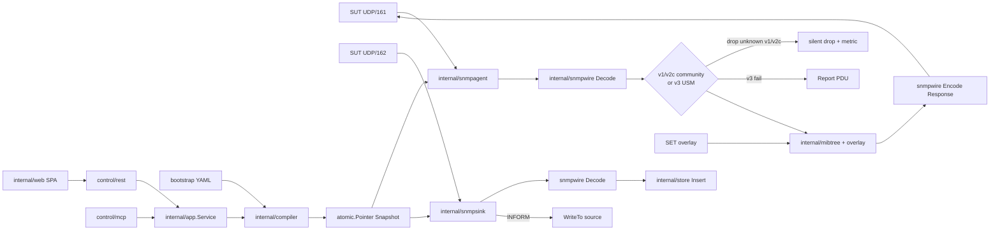

# LabSNMP 1.0 — Implementation-Ready Design

| Field | Value |
|---|---|
| **Title** | LabSNMP 1.0 implementation design |
| **Author** | Grok (design-doc-writer) |
| **Date** | 2026-09-04 |
| **Status** | Draft |
| **Product** | LabSNMP |
| **Target repo** | `github.com/hilather/go-lab-snmp` |
| **Workspace** | `/home/brewerm/git/go-lab-snmp` |
| **Source pack** | `/home/brewerm/git/go-lab-snmp/go-lab-snmp-design-pack/go-lab-snmp-design/` |
| **Authority order** | ADRs > `AGENTS.md` > numbered `docs/00`–`13` > `docs/implementation-design.md` > wave tasks |

This document synthesizes the hilather design pack into one implementation-ready spec. It does **not** replace the architecture. It resolves pack-internal conflicts, fills gaps that would block coding, and maps the program board into independently mergeable PRs.

Living product files land at the **repository root**. The design pack stays in-tree as a frozen reference. After FND-001, edit root `docs/`, `AGENTS.md`, and `tasks/` — not the pack.

---

## Overview

LabSNMP is a single-process Go laboratory SNMP appliance. Systems under test speak SNMPv1/v2c/v3 over UDP/161. LabSNMP answers GET/GETNEXT/GETBULK/SET from YAML OID maps bound **per community** and **per USM user** (split-horizon). UDP/162 is a receive-only trap/inform sink: store, wait, never forward, never originate. INFORM acknowledgements are `WriteTo` on the trap socket.

Management (REST `/v1`, MCP `/mcp`, operator SPA `/`) is a second plane in the same process. It may be off. The data plane keeps answering if management is unbound or slow. REST and MCP are adapters over one `internal/app.Service` and one `internal/capabilities` registry. MCP must not HTTP-call REST.

This is laboratory software, not a production agent, not snmpd, not a manager. Closest siblings: LabNTP (first-party UDP responder, two-plane process, `spec.auth`, NET_BIND_SERVICE) and LabMail (receive-only store, wait, wipe). Integrator pin (`mcp-integration-lab`) is last and orchestration-only.

---

## Background & Motivation

`mcp-integration-lab` already publishes DNS, LDAP, TACACS+/RADIUS, SMTP, HTTP intercept, NTP, and SSO. Network devices and NMSes under test still speak SNMP. There is no first-party appliance that:

- answers `snmpwalk -v2c -c public` with a deterministic ifTable
- presents a different tree on community `vendor` vs `public`
- accepts v3 user `alice` with SHA-256/AES-128
- captures a cold-start trap and lets an agent `snmp_traps_wait`

without wrapping net-snmp or running `snmpd`.

The workspace is greenfield: no application code, **no commits on `main`**, and **`origin/main` is gone** (remote `git@github.com:hilather/go-lab-snmp.git` still exists). The only content is the design pack. FND-001’s first job is to create the initial commit and recreate `origin/main` (K1). Implementation then proceeds as PRs against `main` from this document plus the pack's numbered docs and ADRs.

Pain the pack is solving:

- testers trampling one shared snmpd MIB
- identity collapsed by Docker `userland-proxy` NAT (LabSNMP keys views by community/user, not client IP)
- MCP/REST/UI drift (one capability registry)
- secrets in YAML (file refs)
- accidental trap amplifiers (receive-only, reserved-key reject)

---

## Goals & Non-Goals

### Goals (1.0 GA)

- Agent: Get / GetNext / GetBulk / Set on UDP/161
- Versions: SNMPv1, v2c, v3 USM (MD5 / SHA-1 / SHA-256 + DES / AES-128)
- Per-community and per-user named maps
- SET overlay + REST/MCP `oids:set` sharing that overlay
- Trap/inform capture + wait; INFORM `WriteTo`
- Fail-closed YAML `labsnmp.dev/v1alpha1`, REST `/v1`, MCP `2026-07-28`, operator UI
- Scratch image UID `65532:65532`, native container `:161`/`:162`
- Examples BOM for mcp-integration-lab (SWAP-001 in this repo; integrator PR out of band)
- UI required for 1.0 GA, with Mira review after first UI implementation

### Non-goals (1.0)

- net-snmp / AgentX / gosnmp-as-engine
- SMIv2 compiler
- SNMP over TCP (RFC 3430) or DTLS (RFC 6353) — schema keys exist; `enabled: true` rejects
- Trap originator or forwarder
- Manager that walks external agents
- SHA-384/512, AES-192/256
- Product logic in `mcp-integration-lab`
- Prometheus client library
- OAuth PRM / HTTP Basic
- Durable spool / multi-replica
- Independent VACM group/view DSL (1.0 is user/community → map)

### Deferred (v1.1)

TLS-001: DTLS / TCP SNMP. Does not reopen GA-001. Schema keys stay in 1.0 and reject.

---

## Frozen identity

Copied from `AGENTS.md`. Do not rename.

| Field | Value |
|---|---|
| Product | LabSNMP |
| Binary | `labsnmp` |
| Module | `github.com/hilather/go-lab-snmp` |
| Image | `ghcr.io/hilather/labsnmp` (`:local` for compose builds) |
| Schema | `labsnmp.dev/v1alpha1` |
| Kind | `LabSNMP` |
| Cookie | `labsnmp_session` |
| CSRF | `X-LabSNMP-CSRF` |
| User | `65532:65532` |
| Config | `/etc/labsnmp/config.yaml` |
| Token | `/run/secrets/labsnmp-token` |
| labinfo id | `labsnmp` |
| MCP tools | `snmp_*` |
| Resources | `labsnmp://…` |
| MCP protocol | `2026-07-28` |
| MCP SDK | `github.com/modelcontextprotocol/go-sdk v1.7.0` |
| Go | **1.26 language** (`go.mod` `go 1.26.0`). Any installed **1.26.x** satisfies the pack. Do not hard-fail because patch `1.26.6` is absent. No `toolchain` requirement. |
| License | Apache-2.0 |

### Ports

| Plane | IANA | Container | Host residual (lab default) | Local escape |
|---|---|---|---|---|
| Agent | 161/udp | `:161/udp` | 10161/udp | `:1161` (`--snmp-listen=:1161`) |
| Traps | 162/udp | `:162/udp` | 10162/udp | `:1162` (`--trap-listen=:1162`) |
| Management | n/a | `:8088/tcp` | 18161/tcp | `--management-listen=:8088` |

`--management-listen` defaults **off**. Image `CMD` binds `:8088` so HEALTHCHECK and `/v1` work.

Env (integrator, SWAP-001, **docs/13 names win**): `LABSNMP_AGENT_PORT`, `LABSNMP_TRAP_PORT`, `LABSNMP_REST_PORT`. `LABSNMP_MGMT_PORT` (docs/00) is a **rejected alias** — not YAML, not compose, not labinfo. Do not read it.

---

## Key Decisions

Authority: ADRs > `AGENTS.md` > numbered docs > `docs/implementation-design.md` > wave tasks. Family patterns from LabNTP/LabMail fill **mechanical** gaps (Makefile, CI, Vite+React SPA, problem+json shape) without changing LabSNMP architecture.

### K1 — Repository layout

**Decision:** Product code, living docs, Makefile, and CI live at `/home/brewerm/git/go-lab-snmp` (repo root). `go-lab-snmp-design-pack/` remains a frozen reference snapshot. FND-001 copies pack `AGENTS.md`, numbered docs, ADRs, tasks, START-HERE, README, CONTRIBUTING, SECURITY, CHANGELOG, examples/README into root, then subsequent PRs update **root only**.

FND-001 **step 0 (git)**: this workspace has no commits and `origin/main` is gone. FND-001 **is** the initial commit on `main` (pack snapshot + stubs). Then `git push -u origin main` to recreate `origin/main` so GitHub has a default branch. Subsequent waves are PRs against `main`. `scripts/checkchangelog` / `scripts/checkdocs` MUST treat “no parent / missing `origin/main`” as **empty-diff success** (do not copy LabNTP’s hard `origin/main` default). CI must not assume `origin/main` exists until after that push (`fetch-depth` and Make targets included). `git checkout -b … origin/main` and `gh pr create` against `main` are illegal until step 0 completes.

**Rationale:** The pack says implement from `tasks/00-program-board.md` in the product repo. Dual living docs would drift. Changelog/docs CI copied from LabNTP will fail closed on an empty repo unless the empty-diff path is explicit.

### K2 — Package names: `mibtree` + `snmpagent` (not `mib` / `snmpserver`)

**Conflict:** `AGENTS.md` import fence cites `internal/mib`, `internal/snmpserver`. `docs/01-architecture.md`, `docs/implementation-design.md`, MAP-001, and AGENT-001 all own `internal/mibtree` and `internal/snmpagent`.

**Decision:** Use the numbered architecture + wave ownership:

`cmd/labsnmp`, `internal/{model,config,compiler,snapshot,mibtree,snmpwire,usm,snmpagent,snmpsink,store,app,capabilities,control/rest,control/mcp,auth,audit,domainerr,observability,buildinfo,web,testutil,snmptest}` plus `api/{jsonschema,openapi,mcp,capabilities,metrics,errors}` and `web/`.

`AGENTS.md` import fence is updated in FND-001 to those names. The AGENTS names look like a LabNTP copy (`ntpserver` → `snmpserver`). Waves have exclusive package ownership; do not invent a second tree.

### K3 — CLI listen flags: `--snmp-listen` (not `--agent-listen`)

**Conflict:** START-HERE and `docs/11-deployment.md` use `--snmp-listen`. `docs/implementation-design.md` CLI block uses `--agent-listen`.

**Decision:** `--snmp-listen`, `--trap-listen`, `--management-listen`. Family analog is LabNTP `--ntp-listen`. `off` / `none` / `-` disable a listener. START-HERE + numbered deployment doc beat the summary.

```
labsnmp version
labsnmp validate --config FILE
labsnmp canonicalize --config FILE [--format yaml|json]
labsnmp serve --config FILE [--snmp-listen ADDR|off] [--trap-listen ADDR|off] [--management-listen ADDR|off] [--shutdown-timeout D] [--pid-file FILE]
labsnmp healthcheck --url URL
labsnmp mcp-stdio --config FILE --token-file FILE
```

No manager CLI (`snmpget`/`snmpwalk`/`snmptrap` wrappers). `internal/snmptest` is test-only.

### K4 — Community strings are file refs (`communityFile`)

**Conflict:**

- `AGENTS.md`: "Secrets are file refs. Community strings live in `communityFile`."
- `docs/02-snmp-semantics.md` + D21: inline `community: public` XOR `communityFile`
- `docs/04-state-and-configuration.md`: `name` **is** the community string; optional `secretFile` replaces it; mixing both rejects
- `SECURITY.md`: communities are cleartext lab handles, not secrets
- hilather invariant: secrets are file references, never inline

**Decision:** Honor `AGENTS.md` + the hilather invariant.

- `communities[].name` is a required unique DNS-label **row id** (REST/MCP/UI).
- `communities[].communityFile` is required. Wire community octet string = trimmed file contents. Unique after resolution.
- Inline wire strings (`community:`, `name`-as-wire, `secretFile`) are unknown or validate errors.
- Field name is `communityFile` (AGENTS), not `secretFile` (docs/04).
- USM `auth.secretFile` / `priv.secretFile` file-ref only, ≥8 bytes.
- Management tokens `secretFile` only, ≥32 bytes.
- Missing/short secret files fail **validate** (locked test: "token short / missing file").
- GET state, UI, logs at info, and metrics labels never include secret **bytes**. Paths may appear. `snmp_users_list` redacts file contents.

Integrator compose already mounts `./secrets/snmp-public` and `./secrets/snmp-private`. Testdata uses `testdata/secrets/`.

CFG-001 **must rewrite the living normative docs**, not only this design doc:

- root `docs/02-snmp-semantics.md` — drop inline XOR; wire string = trimmed `communityFile`
- root `docs/04-state-and-configuration.md` — `name` is row id; `communityFile` required; no `secretFile` on communities
- root `SECURITY.md` — v1/v2c communities are cleartext **on the wire** (SNMP has no confidentiality) but **config** still stores them as file refs so bootstrap YAML stays non-secret
- root `docs/implementation-design.md` D21 — replace “inline XOR `communityFile`” with K4
- `docs/adr/0015-community-file-refs.md` — Accepted. Changing this invariant later requires another ADR (`AGENTS.md`)

After FND copies the pack, an engineer implementing CFG-001 from numbered docs must not still see “Inline `community: public` is allowed”.

### K5 — Control-plane implementation order: CFG → APP → API → SEC → MCP

**Conflict:** D8 says "REST → Auth → MCP". `AGENTS.md`, `docs/05`, and the program board say CFG → APP → API → SEC → MCP.

**Decision:** Not a real conflict. D8 is the adapter subsequence. Full order is CFG → APP → API → SEC → MCP. API-001 may stub auth (unauthenticated `/v1` except that SEC-001 immediately locks it). MCP-001 never ships without SEC-001. **DEP-001 depends on SEC-001** so the scratch image is never published with the API-001 stub.

Data plane proceeds after WIRE, independent of management.

### K6 — `valueFrom: uptime` (not `processUptime`)

**Conflict:** D20 `valueFrom: processUptime`. `docs/03-mib-and-trap-store.md` and **ADR 0011** `valueFrom: uptime`.

**Decision:** `uptime`. ADR wins. It is the only dynamic source. Computed at read time from `uptimeEpoch` stamped at snapshot compile (process start). Overlay is ignored. Leaf is never writable (SET / `oids:set` → `notWritable` / `not_writable`).

TimeTicks (RFC 2578 / RFC 3418 `sysUpTime`) are **hundredths of a second**:

```
uint32((now.Sub(uptimeEpoch) / 10ms) % (1<<32))
```

Not seconds, not wall-clock Unix time. Test with `internal/testutil` fake clock: advance 1s → value `100`. CFG-001 rewrites D20 in living `docs/implementation-design.md` to `valueFrom: uptime`.

### K7 — Two planes, one process; no Dial

Agent UDP 161 and trap UDP 162 keep working if management is off or slow.

Production packages `internal/snmpwire`, `internal/mibtree`, `internal/snmpagent`, `internal/snmpsink`, `internal/usm`, `internal/store` MUST NOT import `internal/control`, `internal/web`, or `net/http`.

Production `internal/control/rest` MUST NOT import `internal/web`. `cmd/labsnmp/serve.go` wires `rest.Config.UI` (LabNTP pattern).

**Embed stub (K7 compile path):** FND-001 adds `internal/web` with `go:embed` of `internal/web/dist`. **`go:embed` fails on an empty directory** — FND-001 MUST commit at least one file in `internal/web/dist` (minimal `index.html` stub, e.g. `<!doctype html><title>LabSNMP</title><p>UI assets were not copied</p>`). Do not `mkdir dist` only. `UIEnabled=false` until UI-001 replaces dist with a real Vite tree; DEP-001 still serves the embed only when `UIEnabled` is true, so until UI-001 `GET /` is 404 `application/problem+json`. DEP-001 **does** import `internal/web` for that wiring; it must not require real SPA assets. UI-001 is the PR that replaces the placeholder. Do not leave `internal/web` as `doc.go` only.

Production those packages plus `internal/app` MUST NOT `Dial` / `DialTimeout` / `Dialer.Dial`. INFORM ack is `WriteTo` on the trap socket. No trap originator. No manager CLI.

Forbidden production imports: `github.com/gosnmp/gosnmp`, `github.com/sleepinggenius2/gosmi`, `github.com/k-sone/snmpgo`. Forbidden exec basenames in production: `snmpd`, `snmptrapd`, `snmpget`, `snmpwalk`, `snmptrap`, `snmpinform`. Allowed in `_test.go`.

### K8 — Fail-closed YAML

`KnownFields(true)`. camelCase wire names. kebab aliases reject. `spec.auth` (not `spec.management.auth`). `auth.mode` is `bearer` only. Reserved-key prefixes from `AGENTS.md` (normalized strip `-` `_`, lower-case): `forward*`, `relay*`, `remote*`, `destination*`, `trapdest*`, `notifytarget*`, `proxy*`, `manager*`, `agentx*`, `smux*`, `netsnmp*`, `snmpd*`.

Never rewrite bootstrap YAML. Reset rereads it, clears SET overlay, wipes trap store and query ring, increments `storeGeneration`.

### K9 — SET is overlay, not apply

SNMP SET and REST/MCP `oids:set` write `overlay[map][oid] = newValue`. They are not plan/apply verbs. Reset restores bootstrap values. Revision (canonical YAML hash) does not change on overlay. `storeGeneration` does.

SNMP SET is **two-phase / all-or-nothing** (RFC 3416): `CheckSet` every varbind against overlay+bootstrap first; on the first error return that status and **1-based error-index** and write **nothing**; on success apply all overlay writes and increment `storeGeneration` **once**. REST/MCP `oids:set` body is a **single** `{oid, value}` (docs/06); atomicity is trivial. Do not silently accept a multi-oid REST body in 1.0 (`validation_failed`).

### K10 — Identity is community string or v3 user, not client IP

Do not copy LabNTP unmatched-drop or per-IP views. Docker `userland-proxy` NAT collision does not collapse maps. Trap records still store `remoteAddr` best-effort. `docs/02-snmp-semantics.md` must keep the phrases `NAT collision` and `userland-proxy`.

CIDR admission (`spec.admission.allowClientCidrs`) is a reachability bound, not a view key. Omitted → loopback only. Lab overlay sets `10.99.42.0/24` plus loopback.

### K11 — Allowed 1.0 direct deps

- `gopkg.in/yaml.v3`
- `github.com/modelcontextprotocol/go-sdk v1.7.0` (MCP adapter only — D19)
- `github.com/oklog/ulid/v2` (trap ids; MIT; already family-allowed via LabMail)

Stdlib crypto for USM (`crypto/md5`, `sha1`, `sha256`, `hmac`, `cipher`, `des`, `aes`). New deps need a PR justification and Apache-2.0 license check. Prefer stdlib. No Prometheus client. UI uses Vite + React 19 (family SPA; MIT, Apache-2.0 compatible) isolated in `web/`.

### K12 — UI required for 1.0 GA; Mira review is a gate

`docs/12-web-ui.md` + D16. First UI implementation is UI-001 (PR 14). **Mira review is PR 15** and **blocks 1.0.0 / GA-001**, not SWAP-001. SWAP BOM files do not need Mira. Plans that add UI without Mira review are blocking for GA.

PR 14 lands a Mira checklist in `docs/12-web-ui.md` (pages from this spec, no localStorage tokens, CSRF on mutations, `ui.enabled: false` → 404 problem+json, no send-trap control, cookie `labsnmp_session`). PR 15 ticks that checklist and records sign-off (or absorbs findings). This repo’s **first tag is `v1.0.0` after Mira**. Do not treat an API-complete tree as 1.0.0. An optional `v1.0.0-rc.1` note may be cut after MCP+DEP (API-complete, UI not required); GA-001 does not write that rc as the GA tag.

### K13 — Integrator is last and orchestration-only

SWAP-001 ships copy-paste BOM in **this** repo (`examples/`). Do not implement `internal/lab/vendor.go` here. Integrator PR is out of band. No codec, MIB, or USM logic in `mcplab`.

### K14 — Map object YAML (pack gap, filled from RFCs + docs/02–04)

Numbered docs never list map object fields. WIRE-001 says "types listed in docs/03" but docs/03 does not list BER types. This is a blocking gap, not an architecture change.

**Decision:** 1.0 maps are explicit instance leaves (ADR 0008). Types are the RFC 3416 varbind types. Field names are camelCase. See [OID map YAML](#oid-map-yaml). Do not add a table DSL or SMIv2 compiler.

### K15 — Capability IDs are the docs/05 table

Do not invent a second name. Internal registry keys follow the family dotted form of that table (`version.get`, `maps.list`, `oids.set`, …). MCP tools are exactly the `snmp_*` names in docs/05. REST-only: health live/ready, session, metrics scrape, SPA. `GET /v1/features` rows are K20, not extra capability IDs.

### K16 — Host residual 10161/10162

ADR README mentions ADR 0014 but the file is missing. Numbered docs 00/01/11/13 already freeze residual host publish `10161/udp`, `10162/udp`, `18161/tcp`. FND-001 adds `docs/adr/0014-host-residual-10161-10162.md` capturing that already-accepted decision (does not change behavior).

### K17 — Thin `serve` in AGENT-001 / TRAP-001; DEP-001 owns the image

`cmd/labsnmp` is not “stub until DEP-001”.

- **AGENT-001** introduces `labsnmp serve --config --snmp-listen` with `--management-listen` default **off**. That is the M1 snmpget/walk/set CLI contract.
- **TRAP-001** adds `--trap-listen` to that serve path (M1 snmptrap). `snmpsink` also needs USM for v3 (K18).
- **DEP-001** owns Dockerfile, HEALTHCHECK, `examples/compose.smoke.yaml`, `scripts/test-container.sh`, remaining flags (`--shutdown-timeout`, `--pid-file`), and management HTTP wiring. The scratch image **must not** be buildable against the API-001 auth stub: DEP-001 depends on SEC-001. Health stays unauthenticated; every other `/v1` and `/mcp` route requires bearer.

**Hand-wire until APP-001 (do not steal `internal/compiler` / `internal/snapshot`):** AGENT-001 `serve` has no `compiler.Compile` and must not import `internal/app`. Load path is:

1. `config.Decode` / `Normalize` / `Validate` (CFG-001)
2. `mibtree.Compile` per named map (MAP-001)
3. `usm` key localization + engineID (USM-001)
4. Thin overlay in a **local struct** `snmpagent` can `Load` (e.g. `snmpagent.Runtime`: maps, communities, users, overlay, `uptimeEpoch`)

PDU behavior of that Runtime is the 1.0 agent contract. **APP-001 replaces the hand-wire with `compiler.Compile` + `snapshot.Store` without changing PDU behavior.** `internal/compiler` and `internal/snapshot` stay APP-001 exclusive ownership — do not fork a second compile function in `snmpagent` after APP-001; delete the hand-wire in the same PR that lands compiler/snapshot.

**Trap listener until TRAP-001:** AGENT-001 serve binds **only** the agent socket. Treat trap as CLI `--trap-listen=off` regardless of `spec.listeners.traps.enabled` (default true). Do **not** create a drop-all stub on UDP 162. Ready’s “every enabled data-plane listener bound” clause **does not evaluate traps** until TRAP-001 adds `snmpsink` and `--trap-listen`. After TRAP-001, YAML `traps.enabled` / `--trap-listen` resume their normal meaning.

### K18 — TRAP-001 includes v3 and therefore depends on USM-001

Board TRAP-001 listed only WIRE-001. v3 TRAPs/INFORMs need USM to authenticate, decrypt scopedPDU, and `WriteTo` an authenticated Response. **TRAP-001 depends on WIRE-001 and USM-001.** v1/v2c and v3 share the same store/`WriteTo` rule. `acceptUnauthenticated` default false applies to v3 failures the same way (drop + metric, no store).

WIRE vs USM split: WIRE decodes the v3 header + USM securityParameters + **ciphertext as OCTET STRING**. USM authenticates/decrypts and returns the plaintext scopedPDU to WIRE for PDU parse. WIRE-001 does not implement crypto.

### K19 — Go 1.26 language; any 1.26.x toolchain

Pack freeze is **Go 1.26**, not patch `1.26.6`. FND-001:

- `go.mod`: `go 1.26.0` (still the 1.26 language; any installed 1.26.x satisfies the pack; no `toolchain go1.26.6` requirement)
- `mise.toml` (or `.tool-versions`): `go = "1.26"` so the local mise shim resolves; any installed 1.26.x (this machine has `1.26.5` and `1.26.7`) is enough
- CI: `actions/setup-go` with `go-version: "1.26"` (or a patch setup-go can download, e.g. `1.26.7`). Do **not** set `GOTOOLCHAIN: local` unless that exact patch is installed
- Image: `golang:1.26-alpine` (or `1.26.7-alpine`), not a hard `1.26.6-alpine` pin. Superseded 2026-10-08: the image is patch-pinned to `golang:1.26.9-alpine` with the rest of the go-lab family (stdlib advisories GO-2026-6603..6617); `go.mod` still has no `toolchain` line

### K20 — Features catalog is docs/04 closed ops + listener/engine/auth only

`GET /v1/features` ids are **not** a second capability catalog. Publish only rows derived from docs/04 live apply ops and the reset-only listener / engine / auth rows. **Do not** list `ui.enabled` (bootstrap YAML, LabNTP rule). **Do not** mint `dtls` / `tcp` feature ids; those keys already reject `enabled: true` at validate (`tls_unsupported`).

---

## Conflict register

| ID | Topic | Sources | Resolution |
|---|---|---|---|
| C1 | Package names | AGENTS `mib`/`snmpserver` vs docs/01 `mibtree`/`snmpagent` | K2 — numbered + waves |
| C2 | Listen flag | START-HERE / docs/11 `--snmp-listen` vs summary `--agent-listen` | K3 — `--snmp-listen` |
| C3 | Community secrets | AGENTS file-ref vs D21/docs/02 inline XOR vs docs/04 `name`+`secretFile` | K4 — `communityFile` required |
| C4 | Control-plane order | D8 REST→Auth→MCP vs CFG→APP→API→SEC→MCP | K5 — full board order |
| C5 | `valueFrom` | D20 `processUptime` vs ADR 0011 `uptime` | K6 — `uptime` |
| C6 | Community field names | docs/02 `community` vs docs/04 `name`/`secretFile` vs AGENTS `communityFile` | K4 |
| C7 | docs/04 link `03-oid-maps-and-store.md` | file is `03-mib-and-trap-store.md` | **fix link in FND-001** (test-docs is on in FND) |
| C8 | docs/00 link `13-integration-lab.md` | file is `13-integration-lab-swap.md` | fix link in FND-001 |
| C9 | MANIFEST phantom wave files | `wave-04-mib-tree.md`, `wave-04-oid-tree.md`, `wave-06-agent.md`, `wave-08-application-service.md`, `wave-17-tls-v1.1.md` | actual files in `tasks/` win (`wave-04-oid-map-tree.md`, `wave-06-udp-agent.md`, `wave-08-app-snapshot.md`, `wave-17-dtls-v1.1.md`). Do not create the phantoms |
| C10 | docs/05 table column bleed | extra resource column on some rows | resources listed separately; tools/paths from the table |
| C11 | ADR 0014 missing | README cites it | K16 — write the ADR in FND-001 |
| C12 | validate exit code | CFG-001 says exit 2 on invalid; LabNTP uses 1 | follow the wave: validate **2** on invalid, **2** on missing `--config`, **0** on ok |
| C13 | DEP-001 deps | board omits OBS; wave-13 includes OBS | wave wins — DEP after OBS |
| C14 | example map name | docs/02 `system-if` vs docs/13 `public-if`/`private-if` | lab overlay uses `public-if`/`private-if`; `system-if` is a cloneable example map with the same SNMPv2-MIB system+ifTable content |
| C15 | Management port env | docs/00 `LABSNMP_MGMT_PORT` vs docs/13 `LABSNMP_REST_PORT` | **`LABSNMP_REST_PORT`** (docs/13). `LABSNMP_MGMT_PORT` is a rejected alias |
| C16 | D20/D21/CLI in copied summary | living `docs/implementation-design.md` after FND | FND-001 banner + package/CLI/D8 edits; CFG-001 rewrites D20/D21 |

---

## Proposed Design

### Process model



One process, one container, no persistent volume. Bootstrap YAML is read-only. Runtime overlay + trap inbox + query ring are memory-only.

### Import fence

```text
snmpwire, usm, mibtree, snmpagent, snmpsink, store
        MUST NOT import control, web, net/http, app
        MUST NOT Dial
        MUST NOT import gosnmp/gosmi/snmpgo
        AGENT-001 serve loads snmpagent.Runtime without compiler/snapshot/app

control/rest  MUST NOT import control/mcp or web   (cmd wires UI)
control/mcp   MUST NOT import control/rest or web
              MUST NOT HTTP-call REST
app           MUST NOT Dial
cmd/labsnmp   wires everything
```

AST tests lock Dial, forbidden modules, and forbidden exec basenames on production files. **FND-001** adds the repo-wide Dial / forbidden-module scanners over the listed production packages (empty packages pass). WIRE-001 keeps gosnmp out of `go.mod`. TRAP-001 adds the INFORM `WriteTo` (not Dial) assertion. AGENT/USM/app files must keep passing the FND scanner.

### Ready

Ready = snapshot (or AGENT-001 hand-wire Runtime) installed AND every **enabled** data-plane listener bound AND (management bound OR `--management-listen=off`).

Until TRAP-001, trap is treated as **not enabled for Ready** even if YAML `spec.listeners.traps.enabled` is true (K17). AGENT-001 Ready = agent bound + Runtime loaded + management off.

Not ready: YAML invalid, secret file missing at compile, bind failure, management requested but not bound.

`GET /v1/health/live` is process liveness (management HTTP up). `GET /v1/health/ready` is the ready predicate. Both unauthenticated.

### Listen

- `net.ListenPacket("udp", addr)` for agent and sink
- Client IP `netip.Addr.Unmap()` before CIDR admission
- UID 65532 vs `:161`/`:162` needs `CAP_NET_BIND_SERVICE` on integrator compose
- Appliance tests bind `:1161`/`:1162` with `cap_drop: ALL`
- Flags win over YAML on serve **and** after Reset (LabNTP bind-new-first: bind new, then close old)

---

## Package map

| Package | Role | First PR |
|---|---|---|
| `cmd/labsnmp` | CLI | FND-001: `version`/`help`. CFG-001: `validate`/`canonicalize`. **AGENT-001: thin `serve` (agent bind, management off). TRAP-001: add trap bind.** DEP-001: image + remaining flags + management wiring |
| `internal/buildinfo` | version, MCP protocol constant `2026-07-28` | FND-001 |
| `internal/testutil` | fake clock | FND-001 |
| `internal/domainerr` | catalog codes | FND-001 / CFG-001 |
| `internal/model` | Spec/Community/User/Map/Object/Trap — **no wire types** | CFG-001 |
| `internal/config` | KnownFields, duration, bytesize, OID, reserved keys | CFG-001 |
| `internal/snmpwire` | BER + SNMPv1/v2c/v3 message + PDUs | WIRE-001 |
| `internal/mibtree` | lex-ordered instance tree per map | MAP-001 |
| `internal/usm` | v3 USM auth/priv, engine ID, time window | USM-001 |
| `internal/snmpagent` | UDP 161 listen, dispatch; **hand-wire Runtime until APP-001** | AGENT-001 |
| `internal/snmpsink` | UDP 162 listen, INFORM `WriteTo`, insert | TRAP-001 |
| `internal/store` | trap ring + SET overlay + query ring | TRAP-001 traps; AGENT-001 overlay hook; APP-001 reset |
| `internal/compiler` | Normalize + Validate + compile Snapshot | **APP-001 only** (replaces AGENT-001 hand-wire) |
| `internal/snapshot` | immutable Snapshot + atomic Store | **APP-001 only** |
| `internal/app` | plan/apply/reset/preview/query/traps | APP-001. **AGENT-001 must not import this package.** |
| `internal/capabilities` | frozen REST↔MCP table | API-001 |
| `internal/control/rest` | `/v1` adapter | API-001 |
| `internal/auth` | bearer + cookie CSRF | SEC-001 |
| `internal/audit` | mutation ring | SEC-001 |
| `internal/control/mcp` | `/mcp` adapter | MCP-001 |
| `internal/observability` | slog JSON, OpenMetrics | OBS-001 |
| `internal/web` | `go:embed` SPA | **FND-001 placeholder dist** so serve compiles; UI-001 replaces with Vite tree |
| `internal/snmptest` | test client; not linked from cmd except tests | WIRE-001 / AGENT-001 |

FND-001 creates these dirs with `doc.go` package comments, plus the `internal/web` placeholder embed (**committed non-empty** `internal/web/dist/index.html`) and the Dial/forbidden-module AST tests.

---

## CLI

```
usage: labsnmp <command>

Commands:
  version         print build and protocol metadata
  help            print this help
  validate        fail-closed YAML check (--config)   # exit 0 ok, 2 invalid/usage
  canonicalize    emit canonical spec (--config, --format yaml|json)
  serve           bind agent/trap/management
  healthcheck     probe GET /v1/health/ready (--url)
  mcp-stdio       Streamable MCP over stdio (--config, --token-file)
```

`serve` flags:

| Flag | Default | Behavior |
|---|---|---|
| `--config` | required | bootstrap path |
| `--snmp-listen` | empty → YAML `spec.listeners.agent.address` (`:161`) | `off` disables agent |
| `--trap-listen` | empty → YAML `spec.listeners.traps.address` (`:162`) after TRAP-001 | `off` disables trap. **AGENT-001 serve ignores YAML and behaves as `off` until TRAP-001.** |
| `--management-listen` | **off** | YAML `management.address` does not bind unless this flag is an address. Image CMD `:8088`. |
| `--shutdown-timeout` | 10s | drain |
| `--pid-file` | empty | write pid after binds |

`--management-listen` default off is frozen (START-HERE, docs/01). Do not bind management just because YAML has an address.

---

## Data model — YAML `labsnmp.dev/v1alpha1`

One document. Multi-doc, empty, non-UTF-8, oversize (1 MiB) reject.

```yaml
apiVersion: labsnmp.dev/v1alpha1
kind: LabSNMP
metadata:
  name: <dns-label>
spec: { ... }
```

Pipeline (LabNTP-shaped, LabSNMP fields):

1. `config.Decode` — YAML `KnownFields(true)` / JSON `DisallowUnknownFields`
2. `config.Normalize` — materialize defaults; `1MiB` → 1048576; duration strings
3. `config.Validate` — enums, refs, uniqueness, reserved keys, secret **files opened** (length)
4. **APP-001:** `compiler.Compile` — trees, localized USM keys, `uptimeEpoch`, revision. **AGENT-001 (until then):** hand-wire in K17 (`config` + `mibtree.Compile` + `usm` localize + `snmpagent.Runtime`). Same trees, same overlay GET/SET. No `internal/compiler` package yet.

Revision = `sha256:` + lowercase hex of SHA-256 of **canonical YAML**. Secret **paths** included, secret **bytes** never. SET overlay does not change revision. `storeGeneration` does.

### Field map

#### `spec.listeners`

| Field | Default | Apply |
|---|---|---|
| `agent.enabled` | true | reset-only |
| `agent.address` | `:161` | reset-only |
| `traps.enabled` | true | reset-only |
| `traps.address` | `:162` | reset-only |
| `dtls.enabled` | false | reset-only; `true` → `tls_unsupported` |
| `tcp.enabled` | false | reset-only; `true` → `tls_unsupported` |
| `management.address` | empty | reset-only; process bind is the CLI flag |
| `management.restPath` | `/v1` | reset-only |
| `management.mcpPath` | `/mcp` | reset-only |

#### `spec.auth`

Bearer only. `spec.management.auth` is unknown (`unknown_field`).

| Field | Default |
|---|---|
| `mode` | `bearer` (only legal value) |
| `tokens[].id` | required |
| `tokens[].role` | `administrator` or `reader` |
| `tokens[].secretFile` | required, file exists, ≥32 bytes |

**No `tokens[].scopes` in 1.0.** docs/04 tokens are `id`, `role`, `secretFile` only. Do not invent YAML keys. Role expands to the frozen scope set. An unknown extra field is `unknown_field`.

Roles (docs/04 + docs/05 — **not** LabNTP's three-role set):

| Role | Scopes |
|---|---|
| `administrator` | `snmp.read` `snmp.write` `snmp.admin` `snmp.audit.read` |
| `reader` | `snmp.read` |

Do not add `operator` / `viewer`.

#### `spec.engine`

| Field | Default |
|---|---|
| `engineID` | derived (see below) |
| `engineBoots` | 1 |

Never call `settimeofday`. Engine time is process clock (seconds since process start + boots). RFC 3414 150-second window.

Derived engineID when omitted (docs/04: `8000` + enterprise `0` + `labsnmp` + hostname hash):

```
80 00 00 00     // RFC 3411 enterprise 0, MSB set
04              // text format
"labsnmp"       // ASCII
SHA-256(hostname)[:8]
```

Explicit `engineID` is hex (optional colons), 5–32 octets. Reset-only.

#### `spec.agent`

| Field | Default |
|---|---|
| `versions` | `[v1, v2c, v3]` |
| `maxVarBinds` | 64 |
| `maxRepetitions` | 100 |
| `maxMessageBytes` | `64KiB` |

Live via `replaceAgentCaps`.

#### `spec.admission`

| Field | Default |
|---|---|
| `allowClientCidrs` | loopback `127.0.0.0/8`, `::1/128` if omitted |
| `maxDatagramsPerSec` | 10000 |
| `maxDatagramsPerIP` | 500 |

Lab overlay (`examples/labsnmp.yaml`): also `10.99.42.0/24`. Live via `replaceAdmission`.

#### `spec.traps`

| Field | Default |
|---|---|
| `maxMessages` | 1000 |
| `maxBytes` | `16MiB` |
| `fullPolicy` | `evict_oldest` (`reject` also legal) |
| `maxWait` | `60s` |
| `acceptUnauthenticated` | false |
| `rawRetain` | true |

Live via `replaceTrapStorePolicy`. Unauthenticated traps dropped by default (D28).

#### `spec.ui` / `spec.management` / `spec.observability`

Mirror LabNTP field **names** cited in docs/04:

| Field | Default | Apply |
|---|---|---|
| `ui.enabled` | true | reset-only |
| `management.allowedOrigins` | `[]` (deny-all; no `*`) | reset-only |
| `management.mcp.allowLegacyClients` | false (lab overlay true) | reset-only |
| `management.bodyLimit` | `1MiB` | reset-only |
| `observability.logLevel` | `info` | `replaceObservability` |
| `observability.metrics.publicPath` | false | `replaceObservability` |

`ui.enabled: false` → `GET /` is 404 `application/problem+json`. REST and MCP unchanged.

#### Communities

```yaml
communities:
  - name: public                 # row id, unique, dns-label
    communityFile: /run/secrets/snmp-public
    versions: [v1, v2c]          # optional; default spec.agent.versions minus v3
    access: read                 # read | read-write
    map: public-if               # must exist
```

At least one community **or** one user if the agent is enabled. Community **wire strings** unique after file resolution. Unknown community → silent drop + `labsnmp_auth_fail_total{version="v1|v2c"}`.

#### Users (v3)

```yaml
users:
  - name: alice                  # USM userName, unique
    level: authPriv              # noAuthNoPriv | authNoPriv | authPriv
    auth:
      protocol: sha256           # md5 | sha1 | sha256
      secretFile: /run/secrets/snmp-alice-auth
    priv:
      protocol: aes128           # des | aes128
      secretFile: /run/secrets/snmp-alice-priv
    access: read-write           # read | read-write
    map: private-if
```

Auth without protocol, priv without auth, or unknown protocol → validate error. Other algorithms (`sha384`, `sha512`, `sha224`, `aes192`, `aes256`) → `usm_alg_unsupported` at compile/validate (locked test). Passphrases ≥8 bytes. Localized keys at compile (RFC 3414 A.2 / RFC 7860). VACM is flattened: user → access + named map.

### OID map YAML

```yaml
maps:
  - name: public-if
    objects:
      - oid: "10.20.0.3.10.20.0.5.0"
        name: sysDescr            # optional alias for humans/UI
        type: octetString
        access: read              # read | write
        value: "LabSNMP public-if"
      - oid: "10.20.0.3.10.20.0.4.0"
        name: sysUpTime
        type: timeTicks
        access: read
        valueFrom: uptime         # only legal valueFrom
      - oid: "10.20.0.3.172.16.1.4.1"
        name: ifOperStatus.1
        type: integer
        access: write
        value: 1
        range: { min: 1, max: 7 }
```

| Field | Rule |
|---|---|
| `maps[].name` | required, unique |
| `objects[].oid` | required, dotted numeric, normalized (no leading `.`, no extra zeros that change identity — `1.3.6` not `1.03.6`) |
| `objects[].name` | optional alias; unique per map if set |
| `objects[].type` | required; see types below |
| `objects[].access` | `read` (default) or `write` |
| `objects[].value` | required unless `valueFrom` |
| `objects[].valueFrom` | `uptime` only |
| `objects[].range` | optional `{min,max}` for integer / unsigned32 / gauge32 |
| `objects[].size` | optional `{min,max}` octet length for octetString / opaque |

Duplicate OID in a map → compile error. Empty `objects` is legal (MAP-001 tests empty map). Sharing a map across identities is allowed. No implicit public tree (ADR 0009).

**1.0 types** (RFC 3416 varbind syntax; YAML camelCase):

| YAML `type` | Wire |
|---|---|
| `integer` | INTEGER / Integer32 |
| `octetString` | OCTET STRING |
| `objectIdentifier` | OBJECT IDENTIFIER |
| `null` | NULL |
| `ipAddress` | IpAddress (Application 0) |
| `counter32` | Counter32 (Application 1) |
| `gauge32` | Gauge32 (Application 2) |
| `unsigned32` | Unsigned32 (same tag as Gauge32) |
| `timeTicks` | TimeTicks (Application 3) |
| `opaque` | Opaque (Application 4) |
| `counter64` | Counter64 (Application 6) |

Do not add BITS, NsapAddress, or textual-convention types in 1.0. Names (`sysDescr`) are aliases; the wire key is the dotted OID (ADR 0008). Tables are rows of instance OIDs (`ifDescr.1` = `10.20.0.3.172.16.0.2.1.2.1`). No row-status machinery.

Shipped examples (not hardcoded in the engine):

- `public-if` / `system-if` — SNMPv2-MIB system group + a tiny ifTable (2 rows)
- `private-if` — distinct enterprise leaves so isolation tests fail if maps leak

### Live vs reset-only vs overlay

| Live via plan/apply | Reset-only | Data-plane overlay |
|---|---|---|
| `replaceMaps` / `upsertMap` / `removeMap` | listener addresses, enabled flags | SNMP SET / `oids:set` |
| `replaceCommunities` / `upsertCommunity` / `removeCommunity` | auth tokens | trap insert |
| `replaceUsers` / `upsertUser` / `removeUser` | engineID / engineBoots | query-ring insert |
| `replaceTrapStorePolicy` | dtls/tcp flags | |
| `replaceAdmission` | `ui.enabled`, management address/paths | |
| `replaceAgentCaps` | `allowLegacyClients`, `allowedOrigins`, `bodyLimit` | |
| `replaceObservability` | | |

Unknown `op` → `validation_failed`. Listen/auth/engine/dtls/tcp/ui are **not** apply verbs.

Apply requires `expectedRevision` + `Idempotency-Key` (header on REST; field on MCP). Mismatch → `revision_mismatch` with `currentRevision`.

Reset: reread bootstrap, drop overlay, wipe traps + queries, swap snapshot, increment `storeGeneration`. Never writes the file. Flags still win after Reset.

---

## SNMP semantics (implementation contract)

Normative prose is living root `docs/02-snmp-semantics.md` **after CFG-001 rewrites K4** (drop inline community XOR). Until that PR, this section + ADR 0015 are the implementable checklist; do not implement docs/02’s pre-CFG inline `community:` sentence.

### Transports

UDP 161 agent. UDP 162 sink. TCP/DTLS `enabled: true` rejects at validate.

### Community resolution (v1/v2c)

1. Decode community octet string.
2. Match compiled communities by **string bytes**, unique.
3. No match → drop silently. Metric `labsnmp_auth_fail_total{version="v1|v2c"}`.
4. Version not in that community's `versions` → drop.
5. Resolve `map` → compiled tree + overlay.
6. Community `access: read` forbids Set (`noAccess` / `notWritable` per version).

### USM resolution (v3, RFC 3414 / 3826 / 7860)

| Direction | Allowed YAML | RFC |
|---|---|---|
| auth | `md5` | HMAC-MD5-96 (RFC 3414) |
| auth | `sha1` | HMAC-SHA-96 (RFC 3414) |
| auth | `sha256` | HMAC-SHA-256 truncated 192 (RFC 7860 `usmHMAC192SHA256AuthProtocol`) |
| priv | `des` | CBC-DES (RFC 3414) |
| priv | `aes128` | CFB128-AES-128 (RFC 3826) |
| level | `noAuthNoPriv` / `authNoPriv` / `authPriv` | RFC 3414 |

Unknown user / bad engine / failed auth / time window / decrypt → **Report** PDU when possible, else drop. Populate standard `usmStats.*` counters in the Report. Do not leak user existence on v1/v2c.

**Engine discovery (RFC 3414, required for net-snmp interop):** managers (including `snmpget -v3`) first send a datagram with **empty** `msgAuthoritativeEngineID`. LabSNMP MUST answer with an **authoritative Report**:

1. Empty or unknown engineID → Report `usmStatsUnknownEngineIDs` (`10.20.0.3.10.0.0.2.1.1.4`). USM securityParameters **carry this agent’s engineID, engineBoots, and engineTime**. Do **not** require auth/priv on that Report (discovery is unauthenticated).
2. Engine known, unknown userName → Report `usmStatsUnknownUserNames` (`…1.3`).
3. Then the usual wrong-digest / not-in-time-window / unsupported-level / decrypt Reports.

USM-001 unit-tests discovery without UDP. AGENT-001 adds skip-if-missing net-snmp `snmpget -v3 -l authPriv -a SHA-256 -x AES` which **must** succeed via this handshake (discovery + GET).

usmStats counters are **Report-only** unless a YAML map happens to contain those OIDs. Do not auto-inject them into every community/user map.

usmStats OIDs (RFC 3414; do not rename):

| OID | Counter |
|---|---|
| `10.20.0.3.10.0.0.2.1.1.1` | unsupported security level |
| `10.20.0.3.10.0.0.2.1.1.2` | not in time window |
| `10.20.0.3.10.0.0.2.1.1.3` | unknown user names |
| `10.20.0.3.10.0.0.2.1.1.4` | unknown engine IDs |
| `10.20.0.3.10.0.0.2.1.1.5` | wrong digests |
| `10.20.0.3.10.0.0.2.1.1.6` | decryption errors |

Time window: 150 seconds on the process clock. `engineBoots` from spec (default 1); `engineTime` = seconds since process start.

### PDU behavior

**Get.** Exact instance lookup. Missing: v1 `noSuchName` (error-status + error-index); v2c/v3 `noSuchObject` or `noSuchInstance` **in the varbind**.

Without a MIB compiler, distinguish as (test both directions):

- exact instance in the compiled map (overlay then bootstrap) → value
- request is a **proper prefix** of some instance (column/object, not an instance; e.g. `10.20.0.3.10.20.0.5` when `.0` exists) → `noSuchInstance`
- some instance is a **proper prefix of the request** (GET under a scalar, e.g. `10.20.0.3.10.20.0.5.0.1` when `.0` is the leaf) → `noSuchObject`
- no overlap with any instance → `noSuchObject`

**GetNext.** Lexicographic successor in the compiled instance slice (binary search). Whole map is the 1.0 view. End: v1 `noSuchName`; v2c/v3 `endOfMibView`.

**GetBulk (v2c/v3).** RFC 3416 non-repeaters then max-repetitions. Cap repetitions at `spec.agent.maxRepetitions` (default 100). GetBulk on v1 is a parse error (not a PDU). Walk is not a PDU; GETNEXT/GETBULK correctness *is* walk.

**Set (RFC 3416 two-phase).**

1. Identity `access` must be `read-write` (else `noAccess` / `notWritable` per version; error-index of the first failing varbind).
2. Phase 1 — `CheckSet` **every** varbind against overlay+bootstrap: leaf `access: write`, type, range/size, not `valueFrom: uptime`. On the first failure return that error-status and **1-based error-index**. Overlay is **unchanged**.
3. Phase 2 — only if every varbind passed: apply all overlay writes, then `storeGeneration++` **once**. Subsequent GET sees overlay.
4. Reset drops overlay.

Do not implement per-varbind partial commits. REST/MCP `oids:set` is a single oid (docs/06); a body with extra fields or an oid array is `validation_failed`.

SNMP error-status used: `notWritable`, `wrongType`, `wrongLength`, `wrongValue`, `noAccess`, `genErr`, plus v1 `noSuchName` / `tooBig`.

**Trap sink.**

- TRAPv1, SNMPv2-TRAP stored with raw + parsed varbinds.
- INFORM: store then `WriteTo` a Response to the source address. Never Dial.
- v3 TRAP/INFORM: USM authenticates/decrypts first (TRAP-001 depends on USM-001). INFORM Response is USM-wrapped, still `WriteTo`.
- Unknown community/user / failed v3 auth: drop + metric. Do not store unless `spec.traps.acceptUnauthenticated` (default false).

### `internal/snmpwire` types (WIRE-001)

BER subset required by SNMP (RFC 3416 / 3417):

- INTEGER, OCTET STRING, OBJECT IDENTIFIER, SEQUENCE, NULL
- SNMP application types: IpAddress, Counter32, Gauge32, TimeTicks, Opaque, Counter64
- PDU tags: Get, GetNext, Response, Set, Trap-v1, GetBulk, Inform, SNMPv2-Trap, Report
- SNMPv3 header: msgVersion, msgID, msgMaxSize, msgFlags, msgSecurityModel, msgSecurityParameters (USM parsed as the RFC 3414 SEQUENCE, **privParameters / scopedPDU ciphertext left as OCTET STRING**)

WIRE-001 does **not** decrypt or HMAC. USM-001 authenticates/decrypts and returns the plaintext scopedPDU bytes; WIRE then parses the PDU. Encoding a Response/Report is the reverse: WIRE encodes the PDU/scopedPDU; USM wraps auth/priv.

Request-id / msgID preserved. `maxMessageBytes` cap. Round-trip `encode(decode(packet))` for each PDU class in `testdata/packets` (v3 goldens may be unencrypted scopedPDU until USM-001). Fuzz the decoder.

No gosnmp types in `internal/model` (ADR 0002).

### `internal/mibtree` (MAP-001)

Each named map compiles to a sorted slice of instance OIDs. Lookups are binary search. GETNEXT is the successor.

```go
type Tree struct {
    // sorted instances
}

func Compile(objects []model.Object) (*Tree, error)
func (t *Tree) Get(oid OID) Result          // value | noSuchObject | noSuchInstance
func (t *Tree) GetNext(oid OID) Result      // successor | endOfMibView
func (t *Tree) GetBulk(oids []OID, nonRepeaters, maxRepetitions int) []Result
func (t *Tree) CheckSet(oid OID, v Value) error  // access/type/range; overlay apply is store
```

GETNEXT loop over a testdata map returns every leaf once (walk-equivalent). Lex order across `1.3.6` vs `1.3.6.1` is tested.

### Overlay + snapshot

Bootstrap snapshot is immutable. Overlay is a per-map `map[oid]Value` in `internal/store`. GET reads overlay first, then bootstrap, except `valueFrom: uptime` which always computes as `uint32((now.Sub(uptimeEpoch) / 10ms) % (1<<32))`.

```go
// internal/store — conceptual
type Overlay interface {
    Get(mapName, oid string) (Value, bool)
    Set(mapName, oid string, v Value) error
    SetAll(mapName string, pairs []struct{ OID string; Value Value }) error // one generation bump; used by SNMP SET phase 2
    Clear()
}

type TrapStore interface {
    Insert(TrapRecord) (id string, err error)
    Get(id string) (*TrapRecord, error)
    Raw(id string) ([]byte, error)
    List(ListQuery) (ListResult, error)
    Wait(ctx context.Context, filter TrapFilter, timeout time.Duration) (*TrapRecord, error)
    Clear()  // POST traps:clear
    Wipe()   // reset
    Generation() uint64
    Stats() StoreStats
    ReplaceCaps(maxMessages, maxBytes int, policy string) error
}
```

Trap record (docs/03):

| Field | Notes |
|---|---|
| `id` | ULID (`oklog/ulid/v2`) |
| `receivedAt` | RFC 3339 |
| `version` | v1 / v2c / v3 |
| `pduType` | `trapv1` \| `trapv2` \| `inform` |
| `community` / `user` | identity **row name**, never secret bytes |
| `remoteAddr` | best-effort under Docker userland-proxy |
| `enterprise` / notification OID | |
| `varbinds` | parsed |
| `raw` | if `rawRetain` |
| `parseWarning` | best-effort decode |

Wait filter (fields that exist on the record): `version`, `pduType`, `community`, `user`, `notificationOid`, `since`. Timeout capped by `spec.traps.maxWait` (default 60s). Timeout → `wait_timeout`. Wipe during wait → `store_wiped`.

Query ring: last-N PDU summaries for `GET /v1/queries`. Default size **256**, not a YAML key (docs/04 has no queryLog field; do not invent one). Fields: request type, identity **row name**, decision, error status. No USM keys, no community wire strings, no payloads.

`fullPolicy: evict_oldest` drops oldest by `receivedAt` until the new record fits. A single record larger than `maxBytes` is rejected, not an inbox wipe. `reject` → drop + metric.

---

## API / Interface Changes

Greenfield — all APIs are new. Frozen table from `docs/05-control-plane-and-parity.md`.

### REST-only (not MCP tools)

| Capability ID | REST | Notes |
|---|---|---|
| `health.live` | `GET /v1/health/live` | unauthenticated |
| `health.ready` | `GET /v1/health/ready` | unauthenticated |
| `session.create` | `POST /v1/session` | cookie + CSRF; accepts bearer |
| `session.get` | `GET /v1/session` | |
| `session.delete` | `DELETE /v1/session` | |
| `metrics.get` | `GET /v1/metrics` | OpenMetrics; auth unless `metrics.publicPath` |
| SPA | `GET /`, `/login`, client routes | HTML when `ui.enabled` |

### PARITY_REQUIRED

| ID | REST | MCP | Scope |
|---|---|---|---|
| `version.get` | `GET /v1/version` | `snmp_version_get` | `snmp.read` |
| `capabilities.get` | `GET /v1/capabilities` | `snmp_capabilities_get` | `snmp.read` |
| `status.get` | `GET /v1/status` | `snmp_status_get` | `snmp.read` |
| `schema.get` | `GET /v1/schema/config` | `snmp_schema_get` | `snmp.read` |
| `features.list` | `GET /v1/features` | `snmp_features_list` | `snmp.read` |
| `state.get` | `GET /v1/state` | `snmp_state_get` | `snmp.read` |
| `state.validate` | `POST /v1/state:validate` | `snmp_state_validate` | `snmp.admin` |
| `state.export` | `GET /v1/state:export` | `snmp_state_export` | `snmp.admin` |
| `state.reset` | `POST /v1/state:reset` | `snmp_state_reset` | `snmp.admin` |
| `changes.plan` | `POST /v1/changes:plan` | `snmp_change_plan` | `snmp.admin` |
| `changes.apply` | `POST /v1/changes:apply` | `snmp_change_apply` | `snmp.admin` |
| `maps.list` | `GET /v1/maps` | `snmp_maps_list` | `snmp.read` |
| `maps.get` | `GET /v1/maps/{name}` | `snmp_map_get` | `snmp.read` |
| `maps.query` | `POST /v1/maps/{name}:query` | `snmp_map_query` | `snmp.read` |
| `oids.set` | `POST /v1/maps/{name}/oids:set` | `snmp_oid_set` | `snmp.write` |
| `oids.get` | `POST /v1/maps/{name}/oids:get` | `snmp_oid_get` | `snmp.read` |
| `queries.list` | `GET /v1/queries` | `snmp_queries_list` | `snmp.read` |
| `preview.get` | `GET /v1/preview/get` | `snmp_preview_get` | `snmp.read` |
| `communities.list` | `GET /v1/communities` | `snmp_communities_list` | `snmp.read` |
| `users.list` | `GET /v1/users` | `snmp_users_list` | `snmp.read` |
| `traps.list` | `GET /v1/traps` | `snmp_traps_list` | `snmp.read` |
| `traps.get` | `GET /v1/traps/{id}` | `snmp_trap_get` | `snmp.read` |
| `traps.raw` | `GET /v1/traps/{id}/raw` | `snmp_trap_raw_get` | `snmp.read` |
| `traps.wait` | `POST /v1/traps:wait` | `snmp_traps_wait` | `snmp.read` |
| `traps.clear` | `POST /v1/traps:clear` | `snmp_traps_clear` | `snmp.write` |
| `stats.get` | `GET /v1/stats` | `snmp_stats_get` | `snmp.read` |
| `audit.list` | `GET /v1/audit` | `snmp_audit_query` | `snmp.audit.read` |
| `audit.get` | `GET /v1/audit/{id}` | `snmp_audit_get` | `snmp.audit.read` |

Resources (docs/05): `labsnmp://state`, `labsnmp://maps`, `labsnmp://maps/{name}`, `labsnmp://traps`, `labsnmp://traps/{id}`, `labsnmp://stats`, `labsnmp://capabilities`, `labsnmp://status`, `labsnmp://features`, `labsnmp://queries`.

`snmp_map_query` simulates GET/GETNEXT/GETBULK against a named map without sending a datagram.

`snmp_preview_get` / `GET /v1/preview/get` evaluates a **community or user** + oid against the compiled tree without a wire packet (docs/06). Query params: `community` **or** `user`, and `oid`.

`oids:get` / `oids:set` body: `{ "oid": "1.3.6…", "value": … }` — **one oid**. `:set` is overlay (`snmp.write`). Extra keys or an oid array → `unknown_field` / `validation_failed`.

### Features catalog

`GET /v1/features` returns frozen live vs reset-only rows derived from docs/04 **closed apply ops** plus reset-only listener / engine / auth rows (K20). `spec.ui.enabled` is bootstrap YAML, **not** a catalog row. `dtls` / `tcp` are schema keys that reject `enabled: true`; they are **not** feature ids.

| id | apply | Source |
|---|---|---|
| `maps` | live | `replaceMaps` / `upsertMap` / `removeMap` |
| `communities` | live | `replaceCommunities` / `upsertCommunity` / `removeCommunity` |
| `users` | live | `replaceUsers` / `upsertUser` / `removeUser` |
| `trapStorePolicy` | live | `replaceTrapStorePolicy` |
| `admission` | live | `replaceAdmission` |
| `agentCaps` | live | `replaceAgentCaps` |
| `observability` | live | `replaceObservability` |
| `listeners.agent.address` | reset-only | docs/04 reset-only table |
| `listeners.traps.address` | reset-only | docs/04 reset-only table |
| `listeners.management.address` | reset-only | docs/04 reset-only table |
| `engine` | reset-only | docs/04 reset-only `engineID` |
| `auth` | reset-only | docs/04 reset-only auth tokens |

### Errors

`application/problem+json` (RFC 9457) with `code`. Frozen codes from docs/05 plus locked `usm_alg_unsupported`:

`validation_failed`, `unknown_field`, `reserved_key`, `immutable_field`, `revision_mismatch`, `not_found`, `not_writable`, `wrong_type`, `wait_timeout`, `store_wiped`, `unauthorized`, `forbidden`, `origin_not_allowed`, `tls_unsupported`, `no_such_instance`, `end_of_mib_view`, `usm_alg_unsupported`.

Family extras needed for HTTP plumbing (do not rename the frozen set): `method_not_allowed`, `rate_limited`, `internal_error`. Map SNMP walk exceptions to `no_such_instance` / `end_of_mib_view` on the **control-plane preview/query** path.

Problem type URN: `urn:labsnmp:error:<code>`.

### MCP

Protocol `2026-07-28`. Streamable HTTP `POST /mcp`. Stateless. SDK v1.7.0. Bearer only. `labsnmp mcp-stdio --config --token-file`. `allowLegacyClients` default false; lab overlay true (MCPJungle). Pin protocol version; reject others.

MCP must not HTTP-call REST. Both call `app.Service`.

### Auth (management)

- Bearer from `spec.auth.tokens[].secretFile`
- Cookie `labsnmp_session` HttpOnly SameSite=Lax Path=/
- CSRF header `X-LabSNMP-CSRF` in process memory (never localStorage / sessionStorage)
- Origins exact match; default `[]`; missing Origin allowed; loopback exempt (LabNTP)
- Health unauthenticated
- MCP still not public without token (SEC-001)

---

## Operator UI

Required for 1.0 GA. Same-origin Vite + React 19 + react-router-dom, Node `22.14.0`, family `web/` layout (LabNTP/LabMITM). Embedded via `go:embed` of `internal/web/dist`. Talks REST `/v1` only. No send-trap control. No localStorage tokens. Vitest `assertNoTokenStorage`.

Pages from docs/12 (routes):

| Path | Page |
|---|---|
| `/login` | Exchange bearer for cookie |
| `/` | Overview (ready, listeners, revisions, store stats) |
| `/maps` | Map list |
| `/maps/:name` | Tree + leaf overlay edit (`oids:set`) |
| `/communities` | Communities (no wire strings / file contents) |
| `/users` | Users (secret paths may show; contents never) |
| `/traps` | Trap inbox |
| `/traps/:id` | Trap detail + raw |
| `/queries` | Query log |
| `/plan` | plan/apply |
| `/reset` | Gated reset (phrase `RESET`, `snmp.admin`) |
| `/audit` | Audit ring |
| `/features` | live vs reset-only catalog |
| `/status` | Status |

`ui.enabled: false` hides the SPA (404 problem+json).

**Mira review** (PR 15) blocks **GA-001 / 1.0.0**, not SWAP-001. PR 14 adds a checklist to `docs/12-web-ui.md`; PR 15 records sign-off.

---

## Observability

slog JSON to stderr. Hand-rolled OpenMetrics. No Prometheus client.

Series from docs/09 (do not rename):

- `labsnmp_pdus_total{version,pdu,decision}`
- `labsnmp_traps_total{version,decision}`
- `labsnmp_store_messages`
- `labsnmp_store_bytes`
- `labsnmp_apply_total{result}`
- `labsnmp_http_requests_total{code,route}`
- `labsnmp_build_info`

Also emit (needed by locked tests / docs/02, still LabSNMP-prefixed):

- `labsnmp_auth_fail_total{version}`

Client IPs and secret bytes are never metric labels. `labsnmp healthcheck --url=`.

---

## Deployment

Scratch image UID `65532:65532`. `CGO_ENABLED=0`. No Node stage — FND-001 placeholder dist compiles the binary; UI-001 replaces it with a real Vite tree on the host (LabNTP). DEP-001 must not ship with the API-001 auth stub (depends on SEC-001). Health is unauthenticated; all other management routes require bearer.

```
CMD ["serve", "--config=/etc/labsnmp/config.yaml", "--management-listen=:8088"]
HEALTHCHECK CMD ["/labsnmp", "healthcheck", "--url=http://127.0.0.1:8088/v1/health/ready"]
EXPOSE 161/udp 162/udp 8088/tcp
```

Appliance smoke: `:1161` / `:1162`, `cap_drop: ALL`. Integrator: host 10161/10162/18161, `NET_BIND_SERVICE` only because the process binds `:161`/`:162` **inside** the container even when host publish is residual.

Compose service name `labsnmp`. Do not reuse `snmpd`.

---

## Testing strategy

Unit next to the package. Packet goldens from net-snmp `-d` traces. Interop: snmpget/walk/set/trap via `internal/snmptest` and, in `_test.go` only, net-snmp binaries if present (**skip if missing**).

### Locked tests (`AGENTS.md`)

Every one of these must exist and stay green:

- KnownFields unknown-field reject
- reserved-key reject
- `usm_alg_unsupported` for sha384/aes256
- `spec.management.auth` unknown
- token short / missing file
- Dial AST on production packages
- forbidden module AST
- GETNEXT order
- SET overlay cleared by reset
- INFORM WriteTo (not Dial)
- unknown community silent drop

### Additional required coverage (docs/10 + waves)

- Config matrix `testdata/config/valid/*` and `invalid/*` (`make test-config-compat`)
- Community isolation (public cannot see private-only OIDs)
- v3 engine discovery (empty engineID → Report `usmStatsUnknownEngineIDs`) then authPriv GET alice SHA-256/AES; wrong passphrase → Report
- Two-phase SET: one `wrongValue` in a multi-varbind PDU writes **nothing**; error-index is 1-based
- `valueFrom: uptime` fake clock +1s → TimeTicks `100`
- GET prefix-of-instance → `noSuchInstance`; GET under a scalar instance → `noSuchObject`
- INFORM WriteTo to source; wait existing/inserted/timeout/wipe; unauth drop
- REST contracts: query, oids:set, traps wait, state export YAML
- CSRF required on cookie mutating REST; 401 without token; users list redacted
- `make test-parity`: every PARITY_REQUIRED row
- Fuzz snmpwire decoder + OID parse (`test-fuzz-smoke` then GA soak)
- Container script on `:1161`/`:1162`
- Docs phrase lock: `NAT collision`, `userland-proxy`
- Changelog lock on observable paths
- Placeholder Make targets are not no-op success

### Make targets (`AGENTS.md`)

```
make format lint generate verify-generated test test-race
make test-fuzz-smoke test-parity test-config-compat test-docs
make test-container security-scan test-changelog web-test web-build
```

Missing targets **exit 1**. FND-001 defines all names. Unimplemented ones fail closed. CI jobs are added when the target starts working (do not add a CI job that calls a fail-closed placeholder).

Tool pins (family): golangci-lint `v2.12.2`, govulncheck `v1.1.4`, Go **1.26** (CI `1.26` or `1.26.7`, not a hard `1.26.6`), Node `22.14.0`. `.golangci.yml` `version: "2"`, default standard, gofmt. `mise.toml` `go = "1.26"`.

### Documentation-as-part-of-the-change

Every PR that changes behavior:

1. Updates the numbered doc / ADR / AGENTS / CHANGELOG it invalidates
2. Adds a regression test
3. Does not claim REST/MCP/UI exist until they do
4. Stale documentation is a defect

---

## Security & Privacy

Threat model: laboratory appliance on a compose network. Not a production agent.

- Management: file-ref bearer ≥32 bytes, cookie session, CSRF, exact origins
- Data plane v1/v2c: community wire string from `communityFile`; treat as a shared lab handle that still must not appear in YAML
- Data plane v3: USM; 150s window; localized keys at compile
- Trap sink: anyone who can reach 162 can fill the store — admission CIDRs; default drop unauthenticated
- No trap forward (no amplifier). Reserved keys reject any forward/proxy/manager surface
- Secrets never in GET state, UI, info logs, or metric labels
- Overlay and trap inbox are ephemeral (restart/reset wipe)

---

## Rollout Plan

Greenfield. No feature flags beyond YAML `enabled` bits and CLI `off`.

1. M0 FND+CFG — first commit + `origin/main`, fixtures exist, ADRs at root
2. M1 snmpget/walk/set/trap against localhost with **thin `labsnmp serve`** (management off) after AGENT-001 + TRAP-001 — not deferred to DEP-001
3. M2 plan/apply/reset + wait + REST/MCP parity
4. M3 hardened image + `compose.smoke` (DEP after SEC)
5. M4 UI + Mira review + BOM (Mira blocks GA, not SWAP)
6. M5 **tag `v1.0.0`** (fuzz, soak, known-limitations match, Mira sign-off)

Rollback: revert the PR. No data migration (ephemeral state). Integrator pin LAST so a bad rc does not strand the lab.

Optional `v1.0.0-rc.1` (API-complete, UI not required) may be noted after MCP+DEP. **GA-001 tags `v1.0.0` only**, after PR 15 Mira sign-off. Do not ship 1.0.0 from an API-complete-without-UI tree.

---

## Risks

| Risk | Severity | Mitigation |
|---|---|---|
| First-party BER/USM is the critical path and easy to get subtly wrong | High | WIRE-001 goldens from net-snmp `-d`; USM-001 interop with `snmpget -v3 -l authPriv -a SHA-256 -x AES`; fuzz decoder; skip-if-missing net-snmp in CI |
| DES/MD5 in stdlib but lab-only | Medium | Allowlist + `usm_alg_unsupported` tests; SECURITY.md states lab-only |
| UID 65532 cannot bind 161/162 without cap | Medium | ADR 0010; appliance tests use 1161/1162; compose `NET_BIND_SERVICE` |
| Docker userland-proxy NAT collapses client IPs | Low (by design) | Identity is community/user; docs lock NAT phrases; no per-IP views |
| UI without Mira review ships unusable chrome | High | Explicit Mira PR in the plan; GA-001 depends on it |
| Docs drift vs design pack | Medium | Pack frozen; living docs at root; `make test-docs` |
| Capability registry forked between REST and MCP | High | One table; `make test-parity`; adapters must not call each other |
| Secret bytes leak into state export / logs / UI | High | Redaction tests; revision hashes paths not bytes |

---

## Alternatives Considered

### A1 — Wrap net-snmp / AgentX

Rejected by ADR 0002 / 0008. cgo, root, one shared MIB, not GitOps. The product exists to avoid this.

### A2 — gosnmp as the engine

Rejected by ADR 0002. Test clients may use gosnmp in `_test.go` / `internal/snmptest` only. Production types stay first-party.

### A3 — SMIv2 compiler (gosmi / libsmi)

Rejected by ADR 0008. 1.0 maps are explicit YAML. A compiler is a later product if ever.

### A4 — Inline community strings (D21)

Rejected in favor of `communityFile` (K4) to keep the hilather secret-file invariant consistent with tokens and USM keys. Inline would be nicer for `snmpget -c public` demos; testdata files are cheap and the integrator already mounts community files.

### A5 — MCP as a REST proxy

Rejected by ADR 0004 / `AGENTS.md`. One `app.Service`. MCP-over-REST doubles auth, versioning, and error mapping and breaks parity tests.

### A6 — Per-IP views like LabNTP

Rejected by ADR 0009 / docs/02. SNMP identity is community/user. Docker NAT would otherwise merge testers.

### A7 — SET as an apply verb

Rejected by ADR 0011. Testers flip `ifOperStatus` without rewriting desired state. Reset restores bootstrap.

---

## Open Questions

None that block 1.0 implementation. Pack-internal conflicts are resolved in Key Decisions (K1–K20). Process gates (Mira review, integrator PR out of band) are in the PR plan, not product questions.

If a future reviewer wants inline community XOR restored, that is an ADR reversing K4 — do not silently reintroduce D21 during CFG-001.

---

## References

- Design pack: `/home/brewerm/git/go-lab-snmp/go-lab-snmp-design-pack/go-lab-snmp-design/`
- `AGENTS.md`, `START-HERE.md`, `docs/00`–`13`, `docs/adr/0001`–`0015` (0014 residual ports, 0015 communityFile), `docs/implementation-design.md`, `docs/known-limitations.md`
- `tasks/00-program-board.md`, `tasks/parallelization-plan.md`, `tasks/wave-01`–`wave-17`
- Family: LabNTP (`/home/brewerm/git/go-lab-ntp`) for two-plane UDP, Makefile/CI, capabilities, SPA; LabMail for receive-only store/wait
- RFCs: 1157 (v1), 1901/3416 (v2c PDUs), 3411 (architecture / engineID), 3412/3414 (v3/USM), 3416 (PDUs), 3826 (AES), 7860 (SHA-2 USM)
- Integrator BOM: `docs/13-integration-lab-swap.md`

---

## PR Plan

**PR numbers are merge order. Wave IDs (FND-001, AGENT-001, …) are the join key** to `tasks/00-program-board.md`. Do not assume `PR N` equals board row N.

Linear merge order for an execute-plan orchestrator. Parallel notes are in each PR; do not merge out of order. Each PR is independently reviewable and mergeable, updates the docs it invalidates, and adds regression tests. Wave IDs are the backbone.

Capability registry and YAML schema have a single owner each — do not fork them across PRs (`tasks/parallelization-plan.md`).

### PR 1: FND-001 Repository foundation

- **Files/components affected:** initial git commit on `main` + `git push -u origin main`; repo root `go.mod` (`github.com/hilather/go-lab-snmp`, `go 1.26.0`), `mise.toml` (`go = "1.26"`), `LICENSE` (Apache-2.0), `Makefile`, `.golangci.yml`, `.github/workflows/ci.yml`, `cmd/labsnmp` stub (`version`/`help`), `internal/buildinfo`, `internal/testutil`, `internal/domainerr` stub, package `doc.go` files from K2, **`internal/web` placeholder `go:embed` of committed non-empty `internal/web/dist/index.html`**, copy living `AGENTS.md`/`README.md`/`START-HERE.md`/`CONTRIBUTING.md`/`SECURITY.md`/`CHANGELOG.md`/`docs/**`/`tasks/**`/`examples/README.md` from the design pack to root, `docs/adr/0014-host-residual-10161-10162.md`, `scripts/checkdocs`, `scripts/checkchangelog` (empty-diff if no `origin/main`), Dial/forbidden-module AST tests, fail-closed placeholders for unimplemented Make targets
- **Dependencies:** None
- **Description:** **Step 0:** create the first commit on `main` (this may not be a GitHub PR if `origin/main` does not exist) and `git push -u origin main`. Checkout then builds `labsnmp version` with any local 1.26.x. Unimplemented Make targets exit 1. CI runs format, lint, unit, race, test-docs, test-changelog; Go `1.26` via setup-go (not a hard `1.26.6` / `GOTOOLCHAIN=local` pin). Fix AGENTS import-fence names to `mibtree`/`snmpagent`. Fix docs/00 → `13-integration-lab-swap.md` and docs/04 → `03-mib-and-trap-store.md` so `test-docs` is green. Banner on copied `docs/implementation-design.md`: living contract is ADRs + AGENTS + numbered docs; rewrite CLI to `--snmp-listen` and package names to K2. No gosnmp in `go.mod`. At least one race-sensitive test. Design pack directory is not deleted. **`internal/web/dist/index.html` is a committed file** (`go:embed` cannot target an empty dir). `UIEnabled` stays false until UI-001.

### PR 2: CFG-001 Domain and fail-closed YAML

- **Files/components affected:** `internal/model`, `internal/config`, `internal/domainerr` codes, `cmd/labsnmp` `validate`/`canonicalize`, `testdata/config/valid/{defaults,full,split-horizon}.yaml`, `testdata/config/invalid/*`, `testdata/secrets/*`, `api/jsonschema/labsnmp.dev.v1alpha1.json`, `docs/02-snmp-semantics.md`, `docs/04-state-and-configuration.md`, `docs/implementation-design.md` (D20/D21), `docs/adr/0015-community-file-refs.md`, `SECURITY.md`, `CHANGELOG.md`
- **Dependencies:** PR 1
- **Description:** `labsnmp.dev/v1alpha1` loads, normalizes, rejects unknown/kebab/reserved/`spec.management.auth`/`dtls.enabled:true`/`tcp.enabled:true`. **`communityFile` required** (K4); rewrite docs/02 (drop inline XOR), docs/04 (`name` is row id), SECURITY.md, D21. ADR 0015 Accepted. No `tokens[].scopes`. USM file refs; token ≥32; v3 secrets ≥8; missing file fails validate. Map refs must exist; unique community wire strings after resolution; unique user names. `valueFrom` only `uptime` (rewrite D20). `labsnmp validate` exits 0 on valid fixtures and 2 on invalid. Revision stability. Implement `make test-config-compat`. Locked tests: KnownFields, reserved-key, usm_alg_unsupported sha384/aes256, management.auth unknown, token short/missing file.

### PR 3: WIRE-001 First-party SNMP codec

- **Files/components affected:** `internal/snmpwire`, `testdata/packets/**`, fuzz corpus, `internal/snmptest` decode helpers, `CHANGELOG.md`
- **Dependencies:** PR 2
- **Description:** Encode/decode SNMPv1, v2c, v3 messages and Get/GetNext/GetBulk/Set/Response/Trap-v1/SNMPv2-Trap/Inform/Report without leaking library types. BER subset in K14. v3: header + USM parameters + **ciphertext OCTET STRING**; no HMAC/decrypt (USM-001). Request-id preservation. Max message size cap. Round-trip goldens. Fuzz decoder (`test-fuzz-smoke` starts covering snmpwire). No UDP, no USM crypto, no MIB tree. gosnmp stays out of `go.mod`. Critical path.

### PR 4: MAP-001 OID map tree GETNEXT

- **Files/components affected:** `internal/mibtree`, testdata maps, `docs/03-mib-and-trap-store.md`, `CHANGELOG.md`
- **Dependencies:** PR 2
- **Description:** Compile a map into a lex-ordered instance slice. GET / GETNEXT / GETBULK / SET-check (access, type, range). `noSuchObject` vs `noSuchInstance` vs `endOfMibView` including GET-under-scalar → `noSuchObject` and prefix-of-instance → `noSuchInstance`. Duplicate OID rejected. Empty map. Lex order `1.3.6` vs `1.3.6.1`. Walk-equivalent GETNEXT loop returns every leaf once. Overlay apply is not in this PR. *Could have paralleled PR 3 after PR 2; merge after or beside WIRE, never before CFG.*

### PR 5: USM-001 Bounded v3 USM

- **Files/components affected:** `internal/usm`, testdata USM vectors, `docs/adr/0012-bounded-v3-usm.md` if examples needed, `CHANGELOG.md`
- **Dependencies:** PR 3
- **Description:** noAuthNoPriv / authNoPriv / authPriv with MD5, SHA-1, SHA-256 and DES, AES-128. EngineID from spec or derived. Time window on process clock. Localized keys from passphrase files. **RFC 3414 engine discovery:** empty/unknown engineID → unauthenticated authoritative Report `usmStatsUnknownEngineIDs` carrying engineID/boots/time; unknown user after engine known → `unknownUserNames`. usmStats are Report-only unless a YAML map contains those OIDs. Decrypt/HMAC here; return plaintext scopedPDU to WIRE. Wrong passphrase → Report, not panic. Unit-test discovery; skip-if-missing net-snmp GET is AGENT-001.

### PR 6: AGENT-001 UDP 161 responder

- **Files/components affected:** `internal/snmpagent` (including local `Runtime` / `Load`), thin overlay in `internal/store`, **`cmd/labsnmp/serve.go` (introduces thin serve)**, `internal/snmptest` client, interop tests, query-ring insert, `docs/01-architecture.md` / `docs/02-snmp-semantics.md`, `CHANGELOG.md`
- **Dependencies:** PR 3, PR 4, PR 5
- **Description:** `ListenPacket` UDP 161. Admission CIDR + rate. Community isolation. Dispatch GET/GETNEXT/GETBULK/SET. **Two-phase SET** (check all, then commit all, one `storeGeneration` bump). v1 GetBulk dropped. **Introduces `labsnmp serve --config --snmp-listen` with `--management-listen` default off** (K17). **Binds only the agent.** Treat trap as CLI `--trap-listen=off` even if YAML `traps.enabled` is true; do not open 162; do not stub a drop-all sink. Ready’s trap clause is not evaluated yet. **Hand-wire load (K17):** `config.Decode/Normalize/Validate` + `mibtree.Compile` per map + `usm` localization into `snmpagent.Runtime`. **Must not import `internal/app`, `internal/compiler`, or `internal/snapshot`.** Management-off still answers. Locked tests: GETNEXT order, unknown community silent drop, isolation. `valueFrom: uptime` fake-clock 1s → 100. Skip-if-missing net-snmp v3 discovery+GET (alice SHA-256/AES). Acceptance: `snmpwalk -v2c -c public 127.0.0.1:1161 10.20.0.3.2.1.1` lists the public map only.

### PR 7: TRAP-001 UDP 162 trap sink

- **Files/components affected:** `internal/snmpsink`, `internal/store` trap ring, `cmd/labsnmp/serve.go` (`--trap-listen`), INFORM WriteTo AST tests, `docs/03-mib-and-trap-store.md`, `docs/adr/0007-receive-only-traps.md`, `CHANGELOG.md`
- **Dependencies:** PR 3, PR 5, PR 6
- **Description:** `ListenPacket` UDP 162. Store TRAPv1, SNMPv2-TRAP, INFORM including **v3** (USM auth/decrypt; INFORM `WriteTo` of an authenticated Response). Never Dial. Bounded ring, wait, wipe, `acceptUnauthenticated` default false, `parseWarning` on best-effort. ULID ids. Adds `--trap-listen` to the thin serve from AGENT-001 and **starts honoring YAML `traps.enabled`** (Ready’s trap clause turns on). No drop-all stub was created in AGENT-001. Locked tests: INFORM WriteTo (FND already has Dial AST), wait existing/inserted/timeout/wipe, unauth drop. REST/MCP wait comes later; unit Wait on the store is enough. M1 (get/walk/set/**trap** against localhost, management off) is complete after this PR.

### PR 8: APP-001 Snapshot, plan/apply/reset, overlay

- **Files/components affected:** `internal/app`, `internal/compiler`, `internal/snapshot`, overlay reset path in `internal/store`, `docs/04-state-and-configuration.md`, `CHANGELOG.md`
- **Dependencies:** PR 2, PR 4, PR 7
- **Description:** **Owns `internal/compiler` and `internal/snapshot` exclusively.** Replaces the AGENT-001 `snmpagent.Runtime` hand-wire with `compiler.Compile` + `snapshot.Store` **without changing PDU behavior** (same trees, overlay, USM keys, `uptimeEpoch`). Delete the hand-wire in this PR so compile does not fork. Compile snapshot, swap atomically, closed apply ops from docs/04, `expectedRevision` + idempotency, `oids:set` shares overlay with SNMP SET (single oid), reset rereads bootstrap / drops overlay / wipes traps+queries / increments `storeGeneration`. Tests: revision mismatch, idempotent apply, reset restores bootstrap after SET, traps wiped. AGENT overlay hook is now owned here. `snmpagent` / `cmd/labsnmp` load the snapshot; they still must not import `internal/app` from the data plane — `cmd` may import `app` for plan/apply only.

### PR 9: API-001 REST `/v1`

- **Files/components affected:** `internal/capabilities` (frozen table), `internal/control/rest`, `api/openapi/v1.json`, `api/capabilities/v1.json`, `scripts/generate` (partial), contract tests, `docs/05-control-plane-and-parity.md`, `docs/06-rest-api.md`, `CHANGELOG.md`
- **Dependencies:** PR 8
- **Description:** Every PARITY_REQUIRED REST row plus REST-only health. `application/problem+json`. Health live/ready unauthenticated. Auth enforcement is a stub (**must not ship in the image** — DEP waits for SEC). Features catalog is the K20 table only. No MCP, no UI. Contract tests for map query, oids:set, traps wait, state export YAML. Do not invent capability IDs. `make generate` / `verify-generated` start covering OpenAPI + capabilities (MCP/metrics stubs fail closed until those PRs).

### PR 10: SEC-001 Bearer, CSRF, audit

- **Files/components affected:** `internal/auth`, `internal/audit`, REST session handlers, origin checks, redaction, `docs/08-security-architecture.md`, `docs/adr/0005-lab-static-bearer.md`, `CHANGELOG.md`
- **Dependencies:** PR 9
- **Description:** `spec.auth` bearer. Cookie `labsnmp_session` + CSRF `X-LabSNMP-CSRF`. Audit ring. Locks the API-001 stub: every `/v1` route except health (and metrics if `publicPath`) requires bearer or session. MCP still not public without token. Tests: 401 without token; CSRF required on cookie mutating REST; users list redacted; short token already rejected at validate. Origins exact match.

### PR 11: MCP-001 Streamable HTTP + parity

- **Files/components affected:** `internal/control/mcp`, `api/mcp/v1.json`, `cmd/labsnmp` `mcp-stdio`, `testdata/mcp/goldens/{tools,resources,features}.txt`, `docs/07-mcp-api.md`, `docs/adr/0006-pin-mcp-protocol-versions.md`, `go.mod` MCP SDK `v1.7.0`, `CHANGELOG.md`
- **Dependencies:** PR 9, PR 10
- **Description:** `snmp_*` tools, `labsnmp://` resources, protocol `2026-07-28`, Stateless Streamable HTTP `POST /mcp`. SDK only in the adapter. Must not HTTP-call REST. `make test-parity` implemented. `allowLegacyClients` lab overlay true. `mcp-stdio --token-file`. Pin protocol; reject others.

### PR 12: OBS-001 slog + OpenMetrics + ready

- **Files/components affected:** `internal/observability`, `api/metrics/v1alpha1.json`, ready wiring in agent/sink/rest, `docs/09-observability.md`, `CHANGELOG.md`
- **Dependencies:** PR 6, PR 9
- **Description:** Series from docs/09 plus `labsnmp_auth_fail_total`. Ready semantics from docs/01. No Prometheus client. `labsnmp healthcheck`. Generate metrics catalog. Secrets never in labels.

### PR 13: DEP-001 CLI, scratch image, compose.smoke

- **Files/components affected:** `cmd/labsnmp/serve.go` management wiring, `Dockerfile` (`golang:1.26-alpine` or `1.26.7-alpine`, not a hard `1.26.6`), `examples/compose.smoke.yaml`, `scripts/test-container.sh`, `testdata/container/*`, `docs/11-deployment.md`, CI `container-test` job, `CHANGELOG.md`
- **Dependencies:** PR 6, PR 7, PR 9, PR 10, PR 12
- **Description:** Scratch UID 65532. Image CMD management `:8088`. **Depends on SEC-001** — the image must not be buildable with the API-001 auth stub. Health unauthenticated; all other `/v1` and `/mcp` routes require bearer. Wires `rest.Config.UI` to the FND placeholder embed with `UIEnabled=false`. `test-container` binds `:1161`/`:1162` with `cap_drop: ALL`. Interop with net-snmp CLI as client (skip if missing). HEALTHCHECK hits `/v1/health/ready`. Remaining flags `--shutdown-timeout` / `--pid-file`. M3 milestone.

### PR 14: UI-001 Operator SPA (first implementation)

- **Files/components affected:** `web/` (Vite + React 19 + Vitest), `internal/web` real `go:embed` dist (replaces FND placeholder), REST SPA serving, `docs/12-web-ui.md` (pages + **Mira checklist**), `Makefile` `web-install`/`web-test`/`web-build`/`web-embed`, CI `web` job, `CHANGELOG.md`
- **Dependencies:** PR 9, PR 10
- **Description:** Pages from docs/12. REST only. No localStorage tokens. No send-trap control. `ui.enabled: false` → 404 problem+json. Cookie + CSRF. Mira checklist in docs/12: pages present, `assertNoTokenStorage`, CSRF on mutations, disabled UI 404, no send-trap. This is the **first** UI implementation and is **not** GA-complete until Mira review (PR 15). Committed `internal/web/dist` must be a real Vite tree (LabNTP CI pattern).

### PR 15: UI-001 Mira review follow-up

- **Files/components affected:** `web/src/**`, `docs/12-web-ui.md` (checklist sign-off), `CHANGELOG.md`, any REST DTO tweaks Mira requires that stay inside frozen capabilities
- **Dependencies:** PR 14
- **Description:** Blocking process gate for **GA-001 / 1.0.0**, not for SWAP-001. Mira reviews PR 14 against the docs/12 checklist. This PR absorbs findings (a11y, chrome, copy, empty states, map tree UX) and ticks the checklist. If Mira signs off with no diffs, the PR is a short CHANGELOG + docs note recording the review. Do not add capability IDs.

### PR 16: SWAP-001 Integration-lab BOM

- **Files/components affected:** `examples/labsnmp.yaml`, `examples/compose.smoke.yaml` (if needed), `examples/labinfo/services-labsnmp.yaml`, `examples/mcpjungle/servers/labsnmp.json`, `docs/13-integration-lab-swap.md`, `examples/README.md`, `CHANGELOG.md`
- **Dependencies:** PR 11, PR 10, PR 13
- **Description:** Copy-paste BOM: compose service `labsnmp`, labinfo id `labsnmp`, Jungle `labsnmp.json`, secrets mounts, residual ports 10161/10162/18161, env **`LABSNMP_REST_PORT`** (not `LABSNMP_MGMT_PORT`), `NET_BIND_SERVICE`, healthcheck. Maps `public-if`/`private-if`, user `alice`. Do **not** implement `vendor.go` in this repo. Integrator PR is out of band. No product logic for the lab. Mira (PR 15) is not a code dependency of these files.

### PR 17: GA-001 Fuzz, soak, release notes

- **Files/components affected:** `docs/releases/v1.0.0.md`, `docs/known-limitations.md`, `scripts/release-gate` if family-shaped, soak tests, expanded fuzz, tag-gate CI, `CHANGELOG.md`
- **Dependencies:** PR 1 through PR 16
- **Description:** Fuzz BER + OID; soak GETNEXT+SET+trap; residual limitations match docs. All `AGENTS.md` completion commands pass. UI has Mira sign-off (PR 15 is in 1–16). **Tag `v1.0.0` only.** Do not write `v1.0.0-rc.1` as this PR’s GA artifact (an rc note may already exist after MCP+DEP). TLS-001 stays deferred (`enabled: true` still rejects). M5.

### Out of 1.0: TLS-001 DTLS / TCP SNMP (v1.1)

- **Files/components affected:** none in 1.0 beyond schema keys that already reject
- **Dependencies:** PR 13 (when opened)
- **Description:** Do not reopen GA-001. `spec.listeners.dtls.enabled` / `tcp.enabled` already error in CFG-001.
